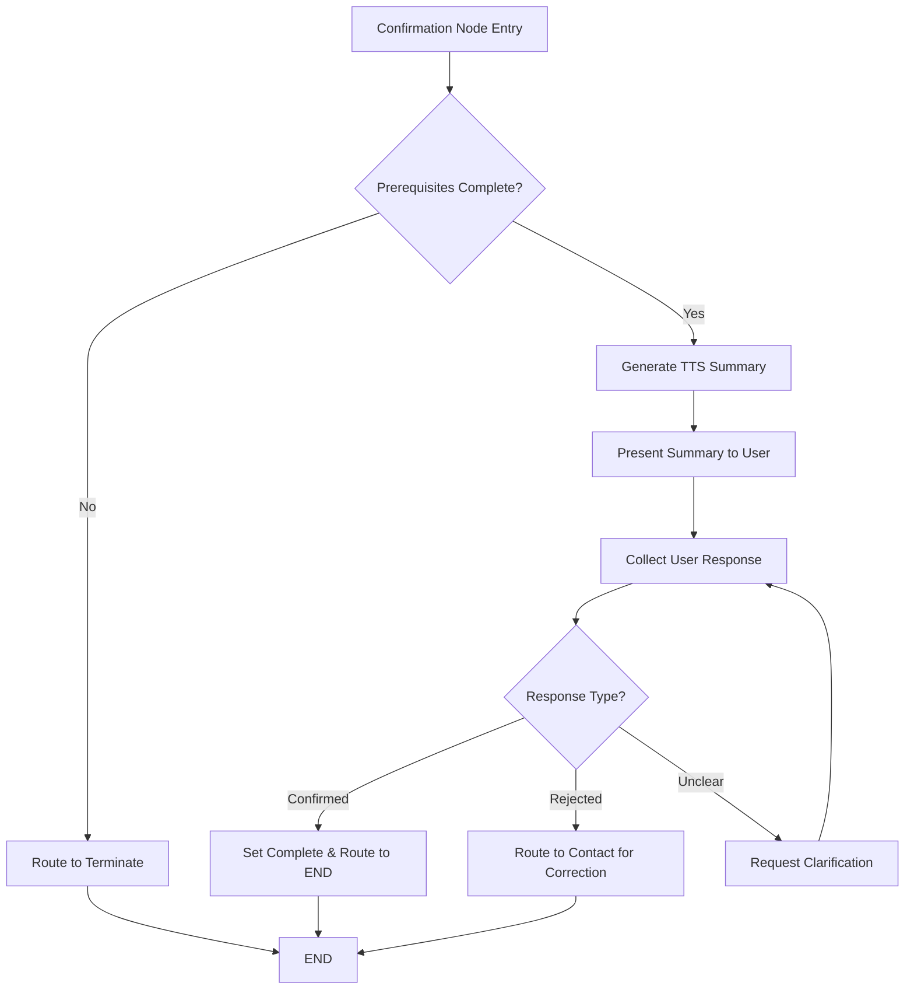

# Confirmation Node — Design (TTS-Optimized, Final Verification Gate v1.0)

## Overview

The **final verification step** that provides a comprehensive, **TTS-friendly summary** of all collected information and obtains **explicit user confirmation** before completing the verification process. This node serves as the **completion gate** for the entire verification flow, implementing voice-optimized data presentation and professional confirmation handling.

* **Success** → `verificationComplete=true`, routes to `END` node
* **Rejection** → routes to `contact` node for correction flow
* **Unclear Response** → retry confirmation with clarification

The node uses **voice-optimized formatting** for all data types and maintains **secure PII handling** during summary generation. All confirmation attempts are logged with proper redaction and session tracking.

## Assumptions

* **Upstream completion:** All prerequisite nodes (identity, contact, financial) have completed successfully
* **Data availability:** Complete collected data available in `state.collected` from previous nodes
* **Voice templates:** TTS-friendly response templates defined externally in `response_templates`
* **State persistence:** Node state stored automatically via LangGraph Postgres checkpointer
* **Confirmation attempts:** Single attempt with clarification loop for unclear responses
* **Fail-closed:** Any system error results in termination routing

## Architecture

### Node Interface

```ts
type ConfirmationNodeInput = {
  state: ConversationState;
  config?: {
    callbacks?: { onEvent?: (e: any) => void };
    configurable?: { thread_id?: string }; // session id for checkpointer
    metadata?: { user_id?: string; applicant_name?: string; scenario_name?: string };
  };
};

type ConfirmationNodeOutput = {
  verificationComplete: boolean;
  completedAt?: string;
  needs: { identity: boolean; contact: boolean; financial: boolean; confirm: boolean };
  confirmationResponse?: 'confirmed' | 'rejected' | 'unclear';
};
```

### Data Models

#### Conversation State Integration

```ts
type ConversationState = {
  identityVerified: boolean;
  collected: {
    identity?: { dobHash: string; ssnLast4Hash: string; verifiedAt: string };
    contact?: { address: Address; email?: string };
    financial?: { monthlyIncome: number; jobTenureMonths: number };
  };
  needs: { identity: boolean; contact: boolean; financial: boolean; confirm: boolean };
  verificationComplete?: boolean;
  completedAt?: string;
};

type Address = {
  street: string;
  city: string;
  state: string;
  zipCode: string;
  unitNumber?: string;
};
```

### Voice Formatting Schema

```ts
type VoiceFormattedSummary = {
  identityConfirmation: string;    // "your identity has been verified"
  contactSummary: string;          // TTS-formatted address and email
  financialSummary: string;        // TTS-formatted income and tenure
  finalPrompt: string;             // "Is all of this information correct?"
};

type VoiceFormatters = {
  formatAddress: (address: Address) => string;
  formatEmail: (email?: string) => string;
  formatMoney: (amount: number) => string;
  formatConfirmationPrompt: () => string;
};
```

## Core Logic

### Algorithm Flow



### Algorithm Steps

1. **Prerequisite Validation**
   * Verify `state.identityVerified === true`
   * Verify `state.collected.contact` exists and is complete
   * Verify `state.collected.financial` exists and is complete
   * If any prerequisite missing, route to `terminate` with system error

2. **Summary Generation**
   * Generate identity confirmation: "Your identity has been verified"
   * Format contact information using voice-optimized formatting
   * Format financial information using voice-optimized formatting
   * Combine into complete TTS-friendly summary

3. **User Confirmation Collection**
   * Present complete summary to user
   * Request explicit confirmation: "Is all of this information correct? Please say yes or no."
   * Parse user response for confirmation intent

4. **Response Processing**
   * **Confirmed responses**: "yes", "correct", "that's right", "confirmed"
   * **Rejected responses**: "no", "incorrect", "that's wrong", "not correct"
   * **Unclear responses**: anything else triggers clarification

5. **State Update & Routing**
   * **On confirmation**: Set `verificationComplete = true`, `completedAt = timestamp`, route to `END`
   * **On rejection**: Set `needs.contact = true`, route to `contact` for correction
   * **On unclear**: Set `needs.confirm = true`, retry confirmation

## Voice Formatting Implementation

### Address Formatting

```ts
function formatAddressForTTS(address: Address): string {
  const parts = [
    formatStreetNumber(address.street),
    address.street.replace(/^\d+\s*/, ''), // Remove number, keep street name
    address.unitNumber ? `Unit ${address.unitNumber}` : null,
    address.city,
    address.state,
    formatZipCode(address.zipCode)
  ].filter(Boolean);
  
  return parts.join(', ');
}

function formatStreetNumber(street: string): string {
  const match = street.match(/^(\d+)/);
  if (!match) return street;
  
  const number = parseInt(match[1]);
  return convertNumberToWords(number); // "123" → "one twenty-three"
}

function formatZipCode(zip: string): string {
  return zip.split('').join(' '); // "80202" → "eight zero two zero two"
}
```

### Email Formatting

```ts
function formatEmailForTTS(email?: string): string {
  if (!email) return "no email address provided";
  
  return email
    .split('')
    .map(char => {
      if (char === '@') return ' at ';
      if (char === '.') return ' dot ';
      return char.toUpperCase();
    })
    .join('-');
  // "john.doe@email.com" → "J-O-H-N dot D-O-E at E-M-A-I-L dot com"
}
```

### Money Formatting

```ts
function formatMoneyForTTS(amount: number): string {
  if (amount >= 1000000) {
    const millions = Math.floor(amount / 1000000);
    const thousands = Math.floor((amount % 1000000) / 1000);
    if (thousands === 0) {
      return `${convertNumberToWords(millions)} million dollars`;
    }
    return `${convertNumberToWords(millions)} million ${convertNumberToWords(thousands)} thousand dollars`;
  }
  
  if (amount >= 1000) {
    const thousands = Math.floor(amount / 1000);
    const remainder = amount % 1000;
    if (remainder === 0) {
      return `${convertNumberToWords(thousands)} thousand dollars`;
    }
    return `${convertNumberToWords(thousands)} thousand ${convertNumberToWords(remainder)} dollars`;
  }
  
  return `${convertNumberToWords(amount)} dollars`;
}
```

## Security Implementation

### PII Redaction in Summary

```ts
function generateSecureSummary(collected: CollectedData): VoiceFormattedSummary {
  return {
    identityConfirmation: "Your identity has been verified", // Never mention actual DOB/SSN
    contactSummary: formatAddressForTTS(collected.contact.address) + 
                   (collected.contact.email ? `, and your email address is ${formatEmailForTTS(collected.contact.email)}` : ''),
    financialSummary: `Your monthly income is ${formatMoneyForTTS(collected.financial.monthlyIncome)}`,
    finalPrompt: "Is all of this information correct? Please say yes or no."
  };
}
```

### Logging Redaction

```ts
function logConfirmationAttempt(config: NodeConfig, response: ConfirmationResponse): void {
  config?.callbacks?.onEvent?.({
    type: "confirmation_attempt",
    data: {
      success: response.confirmed,
      confirmed: response.confirmed,
      reason: response.reason,
      // Redacted data for logging
      identity_verified: true, // boolean only
      contact_provided: !!collected.contact,
      email_provided: !!collected.contact?.email,
      financial_provided: !!collected.financial,
      // No actual PII values
    }
  });
}
```

## Error Handling

### Strategy

| Type | Behavior | Notes |
|------|----------|-------|
| Missing prerequisites | Route to terminate | System error, fail-closed |
| Summary generation error | Route to terminate | System error, fail-closed |
| User unclear response | Retry with clarification | Up to 3 clarification attempts |
| System timeout | Route to terminate | Professional termination script |

### Prerequisite Validation

```ts
function validatePrerequisites(state: ConversationState): ValidationResult {
  const errors: string[] = [];
  
  if (!state.identityVerified) {
    errors.push("Identity not verified");
  }
  
  if (!state.collected.contact?.address) {
    errors.push("Contact information missing");
  }
  
  if (!state.collected.financial?.monthlyIncome) {
    errors.push("Financial information missing");
  }
  
  return {
    valid: errors.length === 0,
    errors,
    reason: errors.length > 0 ? 'INCOMPLETE_DATA' : null
  };
}
```

## LangGraph Integration

### Node Implementation

```ts
// nodes/confirmation.ts
import { RunnableLambda } from "@langchain/core/runnables";
import { generateSecureSummary, parseConfirmationResponse } from "../utils/confirmation";
import { logConfirmationAttempt } from "../utils/logging";

export const confirmationNode = RunnableLambda.from(async ({ state, config }) => {
  const startTime = Date.now();
  
  try {
    // 1) Validate prerequisites
    const validation = validatePrerequisites(state);
    if (!validation.valid) {
      return {
        lastError: { code: validation.reason, recoverable: false },
        needs: { identity: false, contact: false, financial: false, confirm: false }
      };
    }
    
    // 2) Generate TTS-optimized summary
    const summary = generateSecureSummary(state.collected);
    
    // 3) Parse user confirmation response (from conversation context)
    const response = await parseConfirmationResponse(/* conversation text */);
    
    // 4) Log attempt (redacted)
    logConfirmationAttempt(config, response);
    
    // 5) Route based on response
    if (response.confirmed) {
      return {
        verificationComplete: true,
        completedAt: new Date().toISOString(),
        needs: { identity: false, contact: false, financial: false, confirm: false },
        confirmationResponse: 'confirmed'
      };
    }
    
    if (response.rejected) {
      return {
        verificationComplete: false,
        needs: { identity: false, contact: true, financial: false, confirm: false },
        confirmationResponse: 'rejected'
      };
    }
    
    // Unclear response - retry confirmation
    return {
      needs: { identity: false, contact: false, financial: false, confirm: true },
      confirmationResponse: 'unclear'
    };
    
  } catch (error) {
    return {
      lastError: { code: 'SYSTEM_ERROR', recoverable: false },
      needs: { identity: false, contact: false, financial: false, confirm: false }
    };
  }
});
```

### Routing Integration

```ts
const routeFromConfirmation = (state: ConversationState): string => {
  if (state.lastError) return "terminate";
  if (state.verificationComplete) return "END";
  if (state.needs.contact) return "contact"; // Correction flow
  if (state.needs.confirm) return "confirmation"; // Retry
  return "END"; // Default completion
};
```

## Testing Strategy

### Test Data Setup

```ts
const testScenarios = {
  completeVerification: {
    identity: { dobHash: "hash123", ssnLast4Hash: "hash456", verifiedAt: "2024-01-01T10:00:00Z" },
    contact: { 
      address: { street: "1247 Oak Street", city: "Denver", state: "CO", zipCode: "80202", unitNumber: "3B" },
      email: "mthompson.denver@gmail.com"
    },
    financial: { monthlyIncome: 6500, jobTenureMonths: 36 }
  },
  
  missingEmail: {
    identity: { dobHash: "hash789", ssnLast4Hash: "hash012", verifiedAt: "2024-01-01T10:00:00Z" },
    contact: { 
      address: { street: "456 Main Street", city: "Boulder", state: "CO", zipCode: "80301" }
      // No email
    },
    financial: { monthlyIncome: 4200, jobTenureMonths: 18 }
  }
};
```

### Voice Formatting Tests

```ts
describe('Voice Formatting', () => {
  test('formats address correctly', () => {
    const address = { street: "1247 Oak Street", city: "Denver", state: "CO", zipCode: "80202", unitNumber: "3B" };
    const result = formatAddressForTTS(address);
    expect(result).toBe("one thousand two hundred forty-seven Oak Street, Unit 3B, Denver, CO, eight zero two zero two");
  });
  
  test('formats email correctly', () => {
    const email = "john.doe@email.com";
    const result = formatEmailForTTS(email);
    expect(result).toBe("J-O-H-N dot D-O-E at E-M-A-I-L dot com");
  });
  
  test('formats money correctly', () => {
    expect(formatMoneyForTTS(6500)).toBe("six thousand five hundred dollars");
    expect(formatMoneyForTTS(85000)).toBe("eighty-five thousand dollars");
    expect(formatMoneyForTTS(1200)).toBe("one thousand two hundred dollars");
  });
});
```

## Performance Considerations

* **Summary Generation**: Target <500ms for complete summary generation
* **Memory Usage**: Minimal allocation during voice formatting operations
* **Concurrent Sessions**: Independent state management per session
* **Voice Formatting**: Pre-computed number-to-words mapping for performance

## Configuration

```ts
type ConfirmationConfig = {
  MAX_CLARIFICATION_ATTEMPTS: number; // default 3
  SUMMARY_GENERATION_TIMEOUT_MS: number; // default 2000
  VOICE_FORMATTING_ENABLED: boolean; // default true
  PII_REDACTION_LEVEL: 'strict' | 'standard'; // default 'strict'
};
```


## 7) Comprehensive Test Matrix

### ✅ **1. Successful Confirmation**

**Scenario:** Michael Thompson — complete data, user confirms "yes"
**Expected Flow:** `financial → confirmation → END`
**Expected Outcome:** verification_complete

**Assertions:**

| Category | What to Assert |
|----------|----------------|
| **State** | `verificationComplete === true` |
| **Routing** | Routes to `END` node |
| **Summary** | All collected data formatted correctly for TTS |
| **Telemetry** | Event with `{ success:true, confirmed:true }` |
| **Security** | DOB/SSN redacted in summary, email masked |
| **Voice Format** | Email spelled letter-by-letter, money in words |
| **Completion** | `completedAt` timestamp set |

### ❌ **2. User Rejects Information**

**Scenario:** Lisa Chen — complete data, user says "no, that's incorrect"
**Expected Flow:** `financial → confirmation → contact` (correction flow)
**Expected Outcome:** correction_needed

**Assertions:**

| Category | What to Assert |
|----------|----------------|
| **State** | `verificationComplete === false` |
| **Routing** | Routes to `contact` for correction |
| **Correction Flow** | `needs.contact = true, needs.confirm = false` |
| **Telemetry** | Event with `{ success:false, confirmed:false, reason:"USER_REJECTED" }` |
| **Security** | No PII in rejection logs |

### 🔄 **3. Unclear Response → Clarification**

**Scenario:** Robert Johnson — says "maybe" or "I think so"
**Expected Flow:** `confirmation (unclear) → confirmation (retry) → END`
**Expected Outcome:** success_after_clarification

**Assertions:**

| Category | What to Assert |
|----------|----------------|
| **First Response** | `needs.confirm = true` (retry) |
| **Clarification** | "Please say yes or no" prompt |
| **Second Response** | Clear yes/no accepted |
| **Routing** | Eventually routes to END after clarification |
| **Telemetry** | Two events: unclear response, then clear confirmation |

### 📧 **4. Missing Email Address**

**Scenario:** Dorothy Wilson — no email provided in contact phase
**Expected Flow:** `financial → confirmation → END`
**Expected Outcome:** success_without_email

**Assertions:**

| Category | What to Assert |
|----------|----------------|
| **Summary** | Email section omitted or states "no email provided" |
| **Voice Format** | Natural flow without awkward gaps |
| **Completion** | Successful despite missing optional field |
| **Telemetry** | Event notes `email_provided: false` |

### 🏠 **5. Complex Address Formatting**

**Scenario:** Carlos Rodriguez — address with unit number
**Expected Flow:** `financial → confirmation → END`
**Expected Outcome:** success_with_unit

**Assertions:**

| Category | What to Assert |
|----------|----------------|
| **Address Format** | "twelve forty-seven Oak Street, Unit three B, Denver, Colorado, eight zero two zero two" |
| **Voice Pacing** | Natural pauses between address components |
| **ZIP Code** | Digits separated: "eight zero two zero two" |
| **Completeness** | All address components included |

### 💰 **6. Income Formatting Variations**

**Scenario:** Amanda Foster — various income amounts
**Expected Flow:** `financial → confirmation → END`
**Expected Outcome:** success_with_income_formatting

**Assertions:**

| Category | What to Assert |
|----------|----------------|
| **Small Amount** | "$1,200" → "one thousand two hundred dollars" |
| **Large Amount** | "$85,000" → "eighty-five thousand dollars" |
| **Exact Thousands** | "$50,000" → "fifty thousand dollars" |
| **With Cents** | Handle whole dollar amounts only |

### 🔒 **7. Security & PII Redaction**

**Scenario:** Any complete verification
**Purpose:** Ensure no PII exposure in confirmation

**Assertions:**

| Category | What to Assert |
|----------|----------------|
| **DOB Redaction** | Never speak actual DOB, use "your date of birth" |
| **SSN Redaction** | Never speak SSN digits, use "your identity information" |
| **Email Masking** | Spell out email but mask in logs as "****@****.***" |
| **Address Logging** | Address components redacted in telemetry |
| **Session Tracking** | All events tagged with correct `session_id` |

### ⚡ **8. Performance & Timeout**

**Scenario:** Large data summary generation
**Expected Flow:** `financial → confirmation → END`
**Expected Outcome:** success_within_timeout

**Assertions:**

| Category | What to Assert |
|----------|----------------|
| **Summary Generation** | Completes within 2000ms |
| **Voice Formatting** | All formatting functions execute quickly |
| **State Update** | State transitions happen atomically |
| **Memory Usage** | No memory leaks during summary generation |

### 🔄 **9. Concurrent Session Isolation**

**Scenario:** Multiple users confirming simultaneously
**Purpose:** Verify session isolation

**Assertions:**

| Category | What to Assert |
|----------|----------------|
| **State Isolation** | Each session maintains independent confirmation state |
| **No Cross-Talk** | Session A confirmation doesn't affect Session B |
| **Logging** | Events tagged with correct `session_id` |
| **Performance** | No deadlocks or resource contention |

### 🧾 **10. Logging & Telemetry Validation**

**Scenario:** Any confirmation attempt (cross-cutting)
**Purpose:** Ensure event integrity and traceability

**Assertions:**

| Category | What to Assert |
|----------|----------------|
| **Event Structure** | Fields: `session_id`, `user_id`, `node`, `success`, `confirmed`, `reason` |
| **Redactions** | All PII properly redacted in logs |
| **Timestamps** | `created_at` properly set |
| **Session Consistency** | Same `session_id` across all events |
| **Storage** | Row exists in `conversation_events` |

### 🚫 **11. Incomplete Data Handling**

**Scenario:** Missing financial data when confirmation node executes
**Expected Flow:** `confirmation (error) → terminate`
**Expected Outcome:** system_error

**Assertions:**

| Category | What to Assert |
|----------|----------------|
| **Prerequisite Check** | Verify all required data present before summary |
| **Error Handling** | Graceful failure if data missing |
| **Routing** | Route to terminate on system error |
| **Telemetry** | Event with `reason:"INCOMPLETE_DATA"` |
| **Security** | No stack traces in user-facing errors |

### 📱 **12. Voice Formatting Edge Cases**

**Scenario:** Special characters in email/address
**Expected Flow:** `financial → confirmation → END`
**Expected Outcome:** success_with_special_formatting

**Assertions:**

| Category | What to Assert |
|----------|----------------|
| **Email Dots** | "john.doe@email.com" → "J-O-H-N dot D-O-E at E-M-A-I-L dot com" |
| **Address Numbers** | "123 Main St" → "one twenty-three Main Street" |
| **Hyphenated Names** | Handle hyphens in street names naturally |
| **Apostrophes** | Handle possessive forms in addresses |

## 📋 **Tests Summary Table**

| # | Scenario | Type | Expected Flow | Outcome | Key Assertions |
|---|----------|------|---------------|---------|----------------|
| 1 | Successful confirmation | Normal | financial→confirmation→END | verification_complete | TTS formatting, completion state |
| 2 | User rejects information | Negative | financial→confirmation→contact | correction_needed | Rejection handling, correction routing |
| 3 | Unclear response | Clarification | confirmation→confirmation→END | success_after_clarification | Clarification loop, retry logic |
| 4 | Missing email | Optional field | financial→confirmation→END | success_without_email | Optional field handling |
| 5 | Complex address | Formatting | financial→confirmation→END | success_with_unit | Address component formatting |
| 6 | Income variations | Formatting | financial→confirmation→END | success_with_income_formatting | Money formatting variations |
| 7 | Security & PII | Cross-cutting | any | — | PII redaction, security compliance |
| 8 | Performance | Performance | financial→confirmation→END | success_within_timeout | Speed, memory, atomicity |
| 9 | Concurrent sessions | Isolation | parallel sessions | independent | Session isolation, no cross-talk |
| 10 | Logging validation | Cross-cutting | any | — | Event structure, redactions |
| 11 | Incomplete data | Error | confirmation→terminate | system_error | Error handling, fail-closed |
| 12 | Voice edge cases | Formatting | financial→confirmation→END | success_with_special_formatting | Special character handling |


## Dependencies & Versions

* **LangGraph**: ^0.2.0 (state management, routing)
* **number-to-words**: ^1.2.4 (voice formatting utility)
* **Node.js**: 18+ (string manipulation, date handling)
* **TypeScript**: 5.0+ (strict type checking)

## Summary

| Aspect | Implementation |
|--------|----------------|
| **Voice Optimization** | Complete TTS formatting for all data types |
| **Security** | Strict PII redaction in summaries and logs |
| **Reliability** | Prerequisite validation and fail-closed error handling |
| **Integration** | Seamless LangGraph state management |
| **Performance** | Sub-500ms summary generation |
| **Testability** | Comprehensive test matrix with 12 scenarios |
| **Routing** | Proper completion, correction, and retry flows |

This confirmation node design ensures professional completion of the verification process while maintaining security standards and providing excellent voice user experience through optimized TTS formatting.