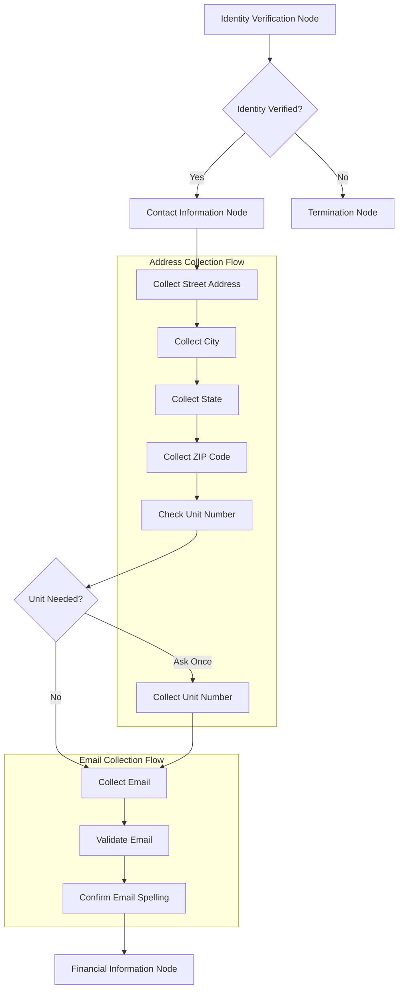

# Contact Information Node Design

## Overview

The Contact Information Node is implemented as a LangGraph node that serves as a **contact collection gate** after successful identity verification. It collects complete mailing address (street, city, state, ZIP) and optional email address with voice-optimized prompts and confirmation loops. The node handles missing unit numbers gracefully with smart detection and single-request collection, validates email with letter-by-letter confirmation, and securely stores all contact data. On successful completion, it unlocks the financial verification step.

**Key Design Decisions:**

- **Single-ownership pattern**: This node owns all contact data extraction, normalization, and validation
- **Voice-first design**: All prompts and confirmations optimized for TTS/voice interfaces
- **Security-by-design**: PII protection through redaction and secure storage from the ground up
- **Graceful error handling**: Professional recovery paths for all validation failures

## Architecture

### Node Integration Pattern

The Contact Information Node integrates with the LangGraph conversation flow and operates conditionally based on identity verification status:



### State Management Integration

The node operates within the existing `VerificationState` schema and updates contact-specific properties. It follows the requirements specification for state structure and implements the exact contract defined in the requirements:

```typescript
interface ContactInformationState {
  // Prerequisites (must be true to proceed) - per requirements R4
  identityVerified: boolean
  
  // Collected contact data (normalized and validated) - per requirements R1, R2, R6
  collected: {
    contact: {
      address: {
        street: string        // Required: normalized street address
        city: string         // Required: normalized city name  
        state: string        // Required: 2-letter uppercase state code (validated against 50 states + DC)
        zipCode: string      // Required: 5-digit or 9-digit format (XXXXX or XXXXX-XXXX)
        unitNumber?: string  // Optional: apartment/suite/unit number (smart detection)
      }
      email?: string         // Optional: normalized lowercase email with format validation
    }
  }
  
  // Flow control flags (routing to next steps) - per requirements R4
  needs: {
    identity: boolean      // false after successful collection
    contact: boolean       // false when complete, true for retry
    financial: boolean     // true when ready for financial step
    confirm: boolean       // false until final confirmation
  }
  
  // Collection progress tracking (prevents duplicate requests) - per requirements R1
  contactProgress: {
    addressComplete: boolean    // true when all address components collected
    emailComplete: boolean      // true when email processed (provided or skipped)
    unitNumberAsked: boolean    // true when unit number request made (prevents re-asking)
  }
  
  // Error handling - per requirements R5
  lastError?: {
    code: string           // Specific error codes for recovery
    recoverable: boolean   // Whether retry is possible
  }
}
```

## Components and Interfaces

### Core Node Implementation

The implementation follows the requirements specification contract with structured extraction and validation. This design implements the exact node contract specified in the requirements section 5:

```typescript
// nodes/contact-information.ts
import { RunnableLambda } from "@langchain/core/runnables"
import { z } from "zod"
import { VerificationState } from "../state"
import { validateAddress, normalizeAddress } from "../utils/address-validation"
import { validateEmail, spellEmailForTTS } from "../utils/email-validation"
import { redactContactPII } from "../security/redaction"

// Structured extraction schemas (per requirements R1, R2)
const AddressExtract = z.object({
  street: z.string().min(1),                           // R1: street address required
  city: z.string().min(1),                            // R1: city required
  state: z.string().length(2),                        // R1: 2-letter state code
  zipCode: z.string().regex(/^\d{5}(-\d{4})?$/),      // R1: 5-digit or 9-digit ZIP format
  unitNumber: z.string().optional()                   // R1: optional unit number
})

const EmailExtract = z.string().email().optional()    // R2: optional email with format validation

export const contactNode = RunnableLambda.from(async ({ state, config }) => {
  // 1) Verify prerequisites (identity must be verified) - per requirements R4
  if (!state.identityVerified) {
    return {
      lastError: { code: "IDENTITY_NOT_VERIFIED", recoverable: false }
    }
  }

  try {
    // 2) Extract address via structured extraction - per requirements R1
    const addressData = await extractWithSchema(AddressExtract)
    const normalizedAddress = normalizeAddress(addressData)

    // 3) Handle unit number if needed and not already asked - per requirements R1
    const finalAddress = await handleUnitNumber(
      normalizedAddress, 
      state.contactProgress?.unitNumberAsked || false
    )

    // 4) Extract and validate email (optional) - per requirements R2, R3
    const emailData = await extractWithSchema(EmailExtract)
    if (emailData && !await confirmEmailSpelling(emailData)) {
      return {
        needs: { ...state.needs, contact: true },
        lastError: { code: "EMAIL_CONFIRMATION_FAILED", recoverable: true }
      }
    }

    // 5) Telemetry (redacted for security) - per requirements R6
    config?.callbacks?.onEvent?.({
      type: "contact_collected",
      data: { 
        addressComplete: true, 
        emailProvided: !!emailData,
        address: redactContactPII(finalAddress),
        email: emailData ? "****@****.***" : null
      }
    })

    // 6) State update (unlock financial step) - per requirements R4
    return {
      collected: {
        ...state.collected,
        contact: { address: finalAddress, email: emailData }
      },
      needs: { identity: false, contact: false, financial: true, confirm: false },
      contactProgress: {
        addressComplete: true,
        emailComplete: true,
        unitNumberAsked: true
      }
    }
  } catch (error) {
    return {
      lastError: {
        code: "CONTACT_COLLECTION_ERROR",
        recoverable: true
      }
    }
  }
})

// Helper functions implementing requirements logic

const extractWithSchema = async (schema: z.ZodSchema): Promise<any> => {
  // Structured extraction using LLM with JSON schema validation
  // Returns parsed and validated data according to schema
}

const handleUnitNumber = async (
  address: any, 
  alreadyAsked: boolean
): Promise<any> => {
  // Smart unit number detection and single-request collection - per requirements R1
  // Only asks once per conversation (tracked in contactProgress)
  if (!alreadyAsked && detectMultiUnitAddress(address.street)) {
    // Ask for unit number with clear prompt - per requirements R3
    const unitNumber = await requestUnitNumber()
    return { ...address, unitNumber }
  }
  return address
}

const confirmEmailSpelling = async (email: string): Promise<boolean> => {
  // Letter-by-letter spelling confirmation for TTS accuracy - per requirements R2, R3
  const spelledEmail = spellEmailForTTS(email)
  const confirmation = await requestConfirmation(
    `Let me spell that back: ${spelledEmail}. Is that correct?`
  )
  return confirmation
}

const detectMultiUnitAddress = (street: string): boolean => {
  // Smart detection of multi-unit addresses requiring unit numbers
  const indicators = ['apartment', 'apt', 'suite', 'ste', 'unit', 'building', '#']
  return indicators.some(indicator => 
    street.toLowerCase().includes(indicator)
  )
}
```

### Voice-Optimized Prompts

Voice prompts designed for TTS compatibility with natural pauses and professional tone, implementing requirements R3 for voice/TTS optimization:

```typescript
// prompts/contact-information.ts
export const CONTACT_PROMPTS = {
  // Address collection (sequential, logical flow) - per requirements R1, R3
  addressRequest: `Now I need your complete mailing address. Please provide your street address, including house or building number.`,
  
  cityRequest: `Thank you. What city is that in?`,
  
  stateRequest: `And what state? Please give me the two-letter state code.`,
  
  zipRequest: `Finally, what is your ZIP code?`,
  
  // Unit number handling (smart detection, single request) - per requirements R1, R3
  unitNumberRequest: `I notice this might be a multi-unit building. Do you have an apartment number, suite number, or unit number?`,
  
  unitConfirmation: (unit: string) => 
    `I have unit ${unit}. Is that correct?`,
  
  noUnitNeeded: `No problem. I'll record the address without a unit number.`,
  
  // Address confirmation with TTS formatting
  addressConfirmation: (address: any) => 
    `Your mailing address is ${formatAddressForTTS(address)}. Is that correct?`,
  
  // Email collection (optional, clearly communicated) - per requirements R2, R3
  emailRequest: `I'd like to collect your email address if you have one. Can you provide your email?`,
  
  noEmailAccepted: `That's perfectly fine. I'll note that you prefer not to provide an email address.`,
  
  // Email spelling confirmation (letter-by-letter for TTS) - per requirements R2, R3
  emailSpelling: (email: string) => 
    `Let me spell that back: ${spellEmailForTTS(email)}. Is that correct?`,
  
  emailCorrection: `I apologize for the confusion. Can you please provide your email address again, speaking slowly?`,
  
  // Completion and transition
  contactComplete: `Perfect! I have your complete contact information. Now let's move on to some financial information.`
}

// Voice formatting utilities (per requirements R3)
export const formatAddressForTTS = (address: any): string => {
  // Natural pauses between components for TTS readability - per requirements R3
  const parts = [address.street]
  
  if (address.unitNumber) {
    parts[0] += `, Unit ${address.unitNumber}`
  }
  
  parts.push(address.city)
  parts.push(address.state)
  parts.push(formatZipForTTS(address.zipCode))
  
  return parts.join(', ')
}

export const spellEmailForTTS = (email: string): string => {
  // Letter-by-letter spelling with @ as "at" and . as "dot" - per requirements R3
  return email
    .replace('@', ' at ')
    .replace(/\./g, ' dot ')
    .split('')
    .join('-')  // Use dashes for clear letter separation
}

export const formatZipForTTS = (zip: string): string => {
  // ZIP codes spelled digit-by-digit - per requirements R3
  if (zip.includes('-')) {
    const [main, ext] = zip.split('-')
    return `${main.split('').join('-')}, dash, ${ext.split('').join('-')}`
  }
  return zip.split('').join('-')
}
```

### Email Validation Component

```typescript
// utils/email-validation.ts
export const validateEmail = (email: string): boolean => {
  const emailRegex = /^[^\s@]+@[^\s@]+\.[^\s@]+$/
  return emailRegex.test(email)
}

export const normalizeEmail = (email: string): string => {
  return email.toLowerCase().trim()
}

export const extractEmailFromText = (text: string): string | null => {
  const emailRegex = /\b[A-Za-z0-9._%+-]+@[A-Za-z0-9.-]+\.[A-Z|a-z]{2,}\b/
  const match = text.match(emailRegex)
  return match ? match[0] : null
}

export const isCommonEmailDomain = (email: string): boolean => {
  const commonDomains = [
    'gmail.com', 'yahoo.com', 'hotmail.com', 'outlook.com',
    'aol.com', 'icloud.com', 'comcast.net', 'verizon.net'
  ]
  
  const domain = email.split('@')[1]?.toLowerCase()
  return commonDomains.includes(domain)
}
```

### Address Validation Component

Address validation utilities implementing requirements R1 for address collection and validation:

```typescript
// utils/address-validation.ts
export const validateState = (state: string): boolean => {
  // Validate against 50 US states + DC - per requirements R1
  const validStates = [
    'AL', 'AK', 'AZ', 'AR', 'CA', 'CO', 'CT', 'DE', 'FL', 'GA',
    'HI', 'ID', 'IL', 'IN', 'IA', 'KS', 'KY', 'LA', 'ME', 'MD',
    'MA', 'MI', 'MN', 'MS', 'MO', 'MT', 'NE', 'NV', 'NH', 'NJ',
    'NM', 'NY', 'NC', 'ND', 'OH', 'OK', 'OR', 'PA', 'RI', 'SC',
    'SD', 'TN', 'TX', 'UT', 'VT', 'VA', 'WA', 'WV', 'WI', 'WY',
    'DC'
  ]
  
  return validStates.includes(state.toUpperCase())
}

export const validateZipCode = (zip: string): boolean => {
  // Validate 5-digit or 9-digit format (XXXXX or XXXXX-XXXX) - per requirements R1
  return /^\d{5}(-\d{4})?$/.test(zip)
}

export const normalizeAddress = (address: any): any => {
  // Normalize components (trim, uppercase state) - per requirements R1, R6
  return {
    street: address.street.trim(),
    city: address.city.trim(),
    state: address.state.toUpperCase().trim(),
    zipCode: address.zipCode.replace(/\s/g, ''),
    unitNumber: address.unitNumber?.trim() || undefined
  }
}

export const detectMultiUnitAddress = (street: string): boolean => {
  // Smart unit number detection for single-request collection - per requirements R1
  const multiUnitIndicators = [
    'apartment', 'apt', 'suite', 'ste', 'unit', 'building', 'bldg',
    'floor', 'fl', '#', 'number', 'no'
  ]
  
  const lowerStreet = street.toLowerCase()
  return multiUnitIndicators.some(indicator => lowerStreet.includes(indicator))
}

export const validateAddress = (address: any): boolean => {
  // Complete address validation combining all components - per requirements R1
  return (
    address.street?.trim().length > 0 &&
    address.city?.trim().length > 0 &&
    validateState(address.state) &&
    validateZipCode(address.zipCode)
  )
}
```

## Data Models

### Contact Data Schema

```typescript
// types/contact.ts
export interface ContactData {
  address: AddressData
  email?: string
}

export interface AddressData {
  street: string
  city: string
  state: string
  zipCode: string
  unitNumber?: string
}

export interface ContactProgress {
  addressComplete: boolean
  emailComplete: boolean
  unitNumberAsked: boolean
}
```

### Database Schema Integration

The contact information integrates with the existing conversation session database architecture:

```sql
-- Extends existing conversation_sessions table from system architecture
-- conversation_sessions (id, status, created_at, updated_at) already exists

-- Contact information storage (new table)
CREATE TABLE contact_information (
  id UUID PRIMARY KEY DEFAULT gen_random_uuid(),
  session_id UUID NOT NULL,
  street_address VARCHAR(255) NOT NULL,
  city VARCHAR(100) NOT NULL,
  state CHAR(2) NOT NULL,
  zip_code VARCHAR(10) NOT NULL,
  unit_number VARCHAR(50),
  email VARCHAR(255),
  created_at TIMESTAMP DEFAULT NOW(),
  updated_at TIMESTAMP DEFAULT NOW(),
  
  CONSTRAINT fk_contact_session 
    FOREIGN KEY (session_id) 
    REFERENCES conversation_sessions(id)
);

-- Extends existing verification_attempts table for contact collection tracking
-- verification_attempts (id, session_id, user_id, node, attempt_number, success, reason, created_at) already exists
-- Contact collection attempts will use node = 'contact'

-- Performance indexes
CREATE INDEX idx_contact_session ON contact_information(session_id);
CREATE INDEX idx_verification_contact ON verification_attempts(session_id, node) 
  WHERE node = 'contact';
```

### Database Integration Pattern

The contact node integrates with the existing database architecture:

1. **Session Management**: Uses existing `conversation_sessions` table for session tracking
2. **Attempt Tracking**: Leverages existing `verification_attempts` table with `node = 'contact'`
3. **Data Storage**: New `contact_information` table stores collected contact data
4. **Referential Integrity**: Foreign key constraints ensure data consistency
5. **LangGraph Checkpointer**: Uses PostgreSQL checkpointer for conversation state persistence

## Error Handling

### Error Classification

Error codes and recovery strategies implementing requirements R5 for error handling and recovery:

```typescript
// types/contact-errors.ts
export enum ContactInformationError {
  IDENTITY_NOT_VERIFIED = 'IDENTITY_NOT_VERIFIED',           // Prerequisites not met
  ADDRESS_INCOMPLETE = 'ADDRESS_INCOMPLETE',                 // Missing address components
  INVALID_STATE_CODE = 'INVALID_STATE_CODE',                // State validation failure
  INVALID_ZIP_FORMAT = 'INVALID_ZIP_FORMAT',                // ZIP format validation failure
  INVALID_EMAIL_FORMAT = 'INVALID_EMAIL_FORMAT',            // Email format validation failure
  EMAIL_CONFIRMATION_FAILED = 'EMAIL_CONFIRMATION_FAILED',  // Spelling confirmation failed
  CONTACT_COLLECTION_ERROR = 'CONTACT_COLLECTION_ERROR'     // General collection error
}

export interface ContactError {
  code: ContactInformationError
  recoverable: boolean
  message: string
  field?: string
  formatExample?: string  // Provide format examples for corrections
}
```

### Error Recovery Strategies

Recovery strategies implementing requirements R5 for graceful error handling and recovery:

1. **Address Validation Errors**:
   - Re-prompt for specific missing or invalid components
   - Provide format examples (e.g., "ZIP code should be 5 digits like 12345")
   - Allow component-by-component correction

2. **State Code Errors**:
   - Request two-letter state abbreviation with examples
   - Provide common state code examples (CA, NY, TX, FL)

3. **ZIP Code Format Errors**:
   - Show format examples (12345 or 12345-6789)
   - Accept both 5-digit and 9-digit formats

4. **Email Format Errors**:
   - Provide format examples (<user@example.com>)
   - Allow re-entry with simplified prompts

5. **Email Confirmation Failures**:
   - Allow correction if spelling confirmation fails
   - Re-spell with clearer pronunciation

6. **System Errors**:
   - Graceful recovery with professional communication
   - Audit trail logging for troubleshooting

## Testing Strategy

### Unit Tests

```typescript
// tests/contact-information.test.ts
describe('Contact Information Node', () => {
  describe('address collection', () => {
    it('should collect complete address with all components', async () => {
      const mockState = createMockStateWithIdentityVerified()
      const result = await contactInformationNode.invoke({
        state: mockState,
        config: { sessionId: 'test-session' }
      })
      
      expect(result.collected.contact.address).toBeDefined()
      expect(result.collected.contact.address.street).toBeTruthy()
      expect(result.collected.contact.address.city).toBeTruthy()
      expect(result.collected.contact.address.state).toBeTruthy()
      expect(result.collected.contact.address.zipCode).toBeTruthy()
    })
    
    it('should handle unit number collection appropriately', async () => {
      const mockState = createMockStateWithMultiUnitAddress()
      const result = await contactInformationNode.invoke({
        state: mockState,
        config: { sessionId: 'test-session' }
      })
      
      expect(result.contactProgress.unitNumberAsked).toBe(true)
    })
  })
  
  describe('email collection', () => {
    it('should validate email format correctly', () => {
      expect(validateEmail('user@example.com')).toBe(true)
      expect(validateEmail('invalid-email')).toBe(false)
    })
    
    it('should handle missing email gracefully', async () => {
      const mockState = createMockStateWithNoEmail()
      const result = await contactInformationNode.invoke({
        state: mockState,
        config: { sessionId: 'test-session' }
      })
      
      expect(result.collected.contact.email).toBeUndefined()
      expect(result.needs.financial).toBe(true)
    })
  })
})
```

### Voice Formatting Tests

```typescript
// tests/voice-formatting.test.ts
describe('Contact Voice Formatting', () => {
  it('should format addresses for TTS correctly', () => {
    const address = {
      street: '123 Main St',
      city: 'Anytown',
      state: 'CA',
      zipCode: '12345'
    }
    
    expect(formatAddressForTTS(address))
      .toBe('123 Main St, Anytown, CA, 1 2 3 4 5')
  })
  
  it('should spell emails correctly', () => {
    expect(spellEmailForTTS('user@example.com'))
      .toBe('u s e r  at  e x a m p l e  dot  c o m')
  })
})
```

## Performance Considerations

### Optimization Strategies

1. **Address Validation**: Cache state abbreviation validation
2. **Email Processing**: Normalize emails before validation
3. **Voice Formatting**: Pre-compute common formatting patterns
4. **Database Operations**: Batch contact information updates

### Monitoring Metrics

- Contact information collection success rate
- Average time to collect complete address
- Email validation error rates
- Unit number clarification frequency
- Voice confirmation success rates

## Security Considerations

### Data Protection Measures

Security implementation following requirements R6 for security and data protection:

1. **Input Validation and Sanitization** (Requirements R6):
   - Validate all inputs before storage per requirements R6
   - Sanitize address and email data to prevent injection attacks
   - Apply strict schema validation using Zod

2. **Data Normalization** (Requirements R6):
   - Normalize email addresses (lowercase, trim) per requirements R6
   - Standardize address formats before storage
   - Apply consistent formatting rules

3. **Secure Storage** (Requirements R6):
   - Encrypt contact information in database per requirements R6
   - Use secure database connections with connection pooling
   - Implement proper access controls

4. **PII Protection** (Requirements R6):
   - Redact contact information in logs and telemetry
   - Use placeholder values in error messages
   - Implement secure audit trail for collection events

5. **Access Control** (Requirements R6):
   - Limit access to contact data based on session
   - Implement proper authentication and authorization
   - Track data access for compliance

### Privacy Features

- **Optional Email Collection**: Clear communication that email is optional
- **Secure Handling**: Address information protected throughout collection
- **Data Minimization**: No unnecessary data retention beyond requirements
- **Transparency**: Clear communication about data usage and storage
- **Audit Trail**: Secure logging of collection events without exposing PII

## Testing Plan — Contact Information Node

This section defines the **test matrix, fixtures, assertions, and tooling** required to validate the Contact Information Node against its requirements (R1–R6) and completion criteria.

---

### A. Fixtures & Harness

**Static fixtures (JSON):**

- `contact_good_address.json` — full US address + email.
- `contact_no_email.json` — full US address, email omitted.
- `contact_multi_unit.json` — street hints at multi-unit; unit arrives on prompt.
- `contact_invalid_zip_then_fix.json` — bad ZIP on first turn, corrected on second.
- `contact_invalid_state_then_fix.json` — bad state on first turn, corrected on second.
- `contact_zip9.json` — ZIP+4 form (“12345-6789”).
- `contact_system_error.json` — simulate DB/write error on first attempt.
- `contact_retry_email_spelling.json` — email captured, first spelling reject then confirm.

**Harness utilities:**

- `replayConversation(fixture)` – feeds turns through LangGraph with Postgres checkpointer.
- `captureEvents()` – collects `conversation_events` rows for assertions.
- `ttsFormat()` – invokes address/email ZIP TTS helpers for golden outputs.
- `maskPII()` – verifies redaction on all structured logs and events.

---

### B. Unit Tests (Fast, isolated)

#### B1) Address extraction & normalization (R1)

**Arrange:** LLM returns `{ street, city, state, zipCode, unitNumber? }`.  
**Assert:**

- `normalizeAddress` trims fields; `state` uppercased.
- ZIP “12345  ” → “12345”; ZIP+4 retained as `XXXXX-XXXX`.
- `validateState("ca") === true` and `validateState("XX") === false`.
- `validateZipCode("12345") === true`, `"12345-6789" === true`, `"1234"` === false.
- `validateAddress(address) === true` only when all required parts valid.

#### B2) Unit number detection (R1)

**Arrange:** `street = "2580 Broadway St Apt 15F"`.  
**Assert:**

- `detectMultiUnitAddress(street) === true`.
- `handleUnitNumber(..., alreadyAsked=false)` prompts once and sets `unitNumberAsked=true`.
- Second pass **does not** prompt again (`alreadyAsked=true`).

#### B3) Email validation & normalization (R2, R6)

**Arrange:** `"  MiKe.Smith+dev@Gmail.com "`  
**Assert:**

- `validateEmail(...) === true`.
- `normalizeEmail(...) === "mike.smith+dev@gmail.com"`.

#### B4) Email spelling confirmation (R2, R3)

**Arrange:** confirmation returns false then true.  
**Assert:**

- First run → `{ lastError.code: "EMAIL_CONFIRMATION_FAILED", needs.contact: true }`.
- Second run → success; `contact.email` persisted.

#### B5) Voice formatting utilities (R3)

**Arrange / Assert:**

- `formatZipForTTS("12345") === "1-2-3-4-5"`.
- `formatZipForTTS("12345-6789") === "1-2-3-4-5, dash, 6-7-8-9"`.
- `spellEmailForTTS("user@example.com")` includes “u-s-e-r  at  e-x-a-m-p-l-e  dot  c-o-m”.
- `formatAddressForTTS({ street:"123 Main St", city:"Anytown", state:"CA", zipCode:"12345" })`
  → `"123 Main St, Anytown, CA, 1-2-3-4-5"`.

#### B6) Reducers & routing flags (R4)

**Arrange:** Complete contact payload.  
**Assert:**

- `needs: { identity:false, contact:false, financial:true, confirm:false }`.
- `contactProgress: { addressComplete:true, emailComplete:true, unitNumberAsked:true }`.
- Idempotency: re-invocation does not duplicate or regress progress.

#### B7) Error surface (R5)

**Arrange:** Invalid state and invalid ZIP.  
**Assert:** `lastError.code` specific (`INVALID_STATE_CODE`, `INVALID_ZIP_FORMAT`), `recoverable:true`, and `needs.contact:true`.

---

### C. Integration Tests (End-to-end through node)

#### C1) Happy path with email (R1–R4)

**Input:** Full address + email in one utterance.  
**Assert:** `addressComplete:true`, `emailComplete:true`, route to `financial`.

#### C2) Happy path without email (R2)

**Input:** Declares “no email”.  
**Assert:** `collected.contact.email` absent; still routes to `financial`.

#### C3) Multi-unit prompt once (R1)

**Input:** Street implies unit; user supplies unit on prompt.  
**Assert:** `unitNumberAsked:true` exactly once; unit persisted.

#### C4) Invalid ZIP then fix (R5)

**Flow:** First `zip="12"` → error; next `zip="94107"` → success.  
**Assert:** two `conversation_events` (fail then success), final route to `financial`.

#### C5) Invalid state then fix (R5)

**Flow:** First `state="Cali"` → error; next `"CA"` → success.  
**Assert:** same pattern as C4.

#### C6) ZIP+4 (R1)

**Input:** `"02139-4307"`.  
**Assert:** accepts, TTS renders with “dash”.

#### C7) Email spelling retry (R2, R3)

**Flow:** First spelling confirmation “no”; second “yes”.  
**Assert:** first returns recoverable error; second persists email and proceeds.

#### C8) System error recovery (R5)

**Arrange:** Simulate DB write error on first attempt.  
**Assert:** recoverable error, retry succeeds, telemetry logs error then success.

---

### D. Telemetry & Logging (Cross-cutting; R6)

**Assertions for any integration case:**

- Event contains `session_id`, `user_id`, `node="contact"`, `event_type`, `attempt_number`, `success`, `reason?`.
- **Redactions:** `address` redacted via `redactContactPII`, `email` logged as `"****@****.***"` when present.
- Monotonic `attempt_number` per session.
- Timestamps increase; DB rows exist for each attempt.

---

### E. Performance & Load

- **Latency:** Node completion p50 ≤ **300 ms**, p95 ≤ **800 ms** (without LLM latency); with LLM JSON extraction p95 ≤ **1500 ms**.
- **Throughput:** 200 RPS synthetic with pooled PG connections; zero failed writes.
- **Memory:** No growth across 10k sequential invocations (leak check).

---

### F. Security & PII

- No raw street/city/state/ZIP/email in application logs; only redacted payloads.
- SQL parameters are bound (no string interpolation).
- Encryption-at-rest verified for `contact_information` table (schema migration applied).
- Access control smoke test: writes require session FK; orphan writes rejected.

---

### G. Concurrency & Idempotency

- Parallel sessions with same `user_id` do **not** cross-contaminate `contactProgress`.
- Re-invoking node with identical inputs is idempotent (no duplicate rows, no counter skew).

---

### H. Golden Replays (Voice/TTS)

- Replays assert exact TTS strings for:
  - Address confirmation (with/without unit).
  - ZIP (5-digit and ZIP+4).
  - Email spelling.
- Any TTS formatting change requires updating golden baselines (approval test).

---

### I. Mapping to Requirements

- **R1 Address** → B1, C1, C3, C4, C6, I.
- **R2 Email** → B3, B4, C2, C7, I.
- **R3 Voice/TTS** → B5, H, I.
- **R4 State/Flow** → B6, C1–C7, I.
- **R5 Errors** → B7, C4, C5, C8, I.
- **R6 Security** → D, F, I.

---

### J. CI Gates & Coverage Targets

- **Commands**
  - `npm test -- --testPathPattern=contact`
  - `npm run build && npm run type-check`
- **Coverage**
  - Lines/Branches/Funcs: **≥ 90%** for `nodes/contact*`, `utils/*validation*`, `prompts/*`.
- **Quality gates**
  - No `console.log` in production code.
  - Mutation score ≥ 70% (if Stryker enabled) for `utils/*validation*`.

---

### K. Example Assertions (Jest-Style)

```ts
expect(result.needs).toEqual({ identity:false, contact:false, financial:true, confirm:false });
expect(result.collected.contact.address.state).toBe("CA");
expect(formatZipForTTS("12345-6789")).toBe("1-2-3-4-5, dash, 6-7-8-9");
expect(events[0]).toMatchObject({ node:"contact", success:false, reason:"INVALID_ZIP_FORMAT" });
expect(events.every(e => e.redactions?.email === undefined || e.redactions.email === "****@****.***")).toBe(true);
````

# Financial Information Node — Test Plan (Exhaustive)

> Scope: This node **extracts, normalizes, validates, and persists** monthly income and job tenure; it also detects tenure discrepancies and sets routing flags. It is the **sole owner** of extraction+normalization for its domain.

## A) Fixtures & Harness

**Fixtures (JSON conversations / inputs)**

- `fin_happy_monthly.json` — “I make $6,500 monthly and worked 42 months.”
- `fin_hourly.json` — “25 dollars an hour, about 2 years.” (period=hourly)
- `fin_weekly.json` — “$1,000 a week, 18 months.”
- `fin_biweekly.json` — “$2,000 every two weeks, 4 years.”
- `fin_annual.json` — “$60k a year, 3 years.”
- `fin_ambiguous_tenure.json` — “around two years and a bit.”
- `fin_invalid_income.json` — “I make -500 a month.”
- `fin_out_of_range_income.json` — “I make $75,000 a month.”
- `fin_invalid_tenure.json` — “I worked 700 months.”
- `fin_missing_income.json` — tenure present, income missing (node must re-prompt).
- `fin_missing_tenure.json` — income present, tenure missing (node must re-prompt).
- `fin_discrepancy_trigger.json` — tenure below threshold; discrepancy flow required.
- `fin_discrepancy_resolved.json` — follow-up clarification accepted.
- `fin_system_error.json` — simulate persistence failure first pass.
- `fin_retry_ok.json` — retry after recoverable error → success.
- `fin_concurrency_A.json` / `fin_concurrency_B.json` — same user_id, different session_id.
- `fin_idempotent_repeat.json` — repeated identical input.

**Harness**

- `replayConversation(fixture, node="financial")`
- `captureEvents(session_id)` → audit/telemetry rows
- `getState(session_id)` → LangGraph checkpointer snapshot
- `withFaults({dbWriteFailOnce?:boolean})` → inject transient faults
- `maskPII(event)` → assert redaction/bucketing
- `ttsFormaters` → `formatIncomeForTTS`, `formatTenureForTTS`

---

## B) Unit Tests (Pure Functions & Deterministic Utilities)

### B1) Income period → monthly conversion

- `convertToMonthly(25, "hourly", 40, 52) ≈ 4333.33` (±1% tolerance)
- `convertToMonthly(1000, "weekly") ≈ 4333.33`
- `convertToMonthly(2000, "biweekly") ≈ 4333.33`
- `convertToMonthly(60000, "annual") = 5000`
- `convertToMonthly(5000, "monthly") = 5000`
- `convertToMonthly("  $1,000  ", "weekly")` parses numeric and converts

### B2) Tenure normalization

- `convertTenureToMonths("2 years") = 24`
- `convertTenureToMonths("1 year 6 months") = 18`
- `convertTenureToMonths("18 months") = 18`
- `convertTenureToMonths("about 3 years") = 36` + returns `ambiguous=true`
- `convertTenureToMonths("2.5 years") = 30` (round to nearest)

### B3) Validation

- `validateIncome(0) = true`
- `validateIncome(50000) = true`
- `validateIncome(-1) = false`
- `validateIncome(50001) = false`
- `validateTenure(0) = true`
- `validateTenure(600) = true`
- `validateTenure(601) = false`

### B4) Bucketing / Redaction

- `bucketIncome(6200) = "5–10k"`
- `bucketIncome(12000) = ">10k"`
- `bucketTenure(11) = "<12m"`
- `bucketTenure(15) = "12–24m"`
- `bucketTenure(30) = ">24m"`

### B5) TTS formatters

- `formatIncomeForTTS(6500)` → contains `"6,500 dollars"`
- `formatTenureForTTS(27)` → `"two years and three months"` (or agreed wording)

### B6) Zod schema coercion (LLM output guard)

- `FinancialExtract.safeParse({ incomeInput:"$1,000", incomePeriod:"weekly", jobTenure:"2 years"})` is success
- Rejects unknown period values; rejects non-numeric tenures after normalization

---

## C) Node-Level Unit (RunnableLambda behavior with stubbed LLM & DB)

### C1) Happy path (monthly + integer tenure)

**Arrange:** parsed `{ incomeInput: 6500, incomePeriod:"monthly", jobTenure: 42 }`  
**Assert:**

- `state.collected.financial = { monthlyIncome:6500, jobTenureMonths:42 }`
- `state.needs = { identity:false, contact:false, financial:false, confirm:true }`
- `financialProgress = { incomeComplete:true, tenureComplete:true, discrepancyHandled:true }`
- Event: `{node:"financial", success:true}` with redactions

### C2) Hourly + string tenure (“2 years”)

- monthly computed ≈ 4333
- tenure = 24
- same flags as C1

### C3) Ambiguous tenure (“around two years”)

- First pass: `lastError.code="TENURE_AMBIGUOUS"`, `needs.financial=true`
- After confirmation input: success, persisted months (24, or clarified value)

### C4) Missing income

- `lastError.code="MISSING_INCOME"`, recoverable:true
- `needs.financial=true`, nothing persisted

### C5) Missing tenure

- `lastError.code="MISSING_TENURE"`, recoverable:true
- `needs.financial=true`

### C6) Invalid income (negative)

- `lastError.code="INVALID_INCOME_AMOUNT"`, recoverable:true

### C7) Income out-of-range (policy)

- `lastError.code="INVALID_INCOME_AMOUNT"`, recoverable:true

### C8) Invalid tenure (>600)

- `lastError.code="INVALID_TENURE"`, recoverable:true

### C9) Discrepancy detection (below threshold)

- When `abs(tenure - threshold.jobTenureMinMonths) >= 3` and not handled:
  - Triggers empathy prompt callback once
  - Returns `needs.financial=true`
  - Sets `financialProgress.discrepancyHandled=true`

### C10) Persistence failure (first pass)

- First: `lastError.code="PERSISTENCE_ERROR"`, recoverable:true
- Second (retry): success pathway

### C11) Idempotency

- Re-invoking node with identical success inputs DOES NOT:
  - duplicate events
  - regress flags
  - change persisted values

---

## D) Integration (through LangGraph with checkpointer & callbacks)

### D1) Full flow success

- Precondition: `identityVerified=true`, `contact` complete
- Input fixture: `fin_happy_monthly.json`
- **Assert routing:** `financial → confirm`
- **State:** matches C1
- **Events:** at least one success event; redactions applied

### D2) Retry on invalid then success

- Input 1: invalid income → recoverable error, `needs.financial=true`
- Input 2: corrected income → success
- Two events: `{success:false, reason:"INVALID_INCOME_AMOUNT"}` then `{success:true}`

### D3) Ambiguous → confirm → success

- First returns TENURE_AMBIGUOUS
- Second confirms 24 months
- Events reflect one failure (recoverable) then success

### D4) Discrepancy flow once

- Tenure deviates ≥3 months from `threshold.jobTenureMinMonths`
- Empathy callback fired exactly once
- On next user clarification, success and `confirm` routing

### D5) Concurrency isolation

- Sessions A & B (same user_id) do not cross-contaminate `financialProgress`
- Events labeled with correct `session_id`

### D6) Idempotent replay

- Re-running same message yields no duplicate writes and no counter skew

### D7) Telemetry & redaction

- Every event: `{ node:"financial", session_id, user_id, success, redacted_fields:{ income_bucket, tenure_range } }`
- No raw amounts; buckets only
- Timestamps monotonically increasing

---

## E) Performance & Reliability

- p95 node latency (excluding LLM) ≤ 300ms
- End-to-end p95 with LLM JSON extract ≤ 1500ms
- With fault injection 1% transient failures → 0% user-visible permanent failures after retry

---

## F) Security

- Verify no raw `incomeInput` / raw tenure phrases in logs
- Verify encrypted-at-rest columns exist and receive values
- SQL parameters are bound (no string interpolation)

---

## G) CI Gates

- `npm test -- --testPathPattern=financial` passes
- `npm run build && npm run type-check` passes
- Coverage ≥ 90% lines/branches for `nodes/financial*`, `utils/*`
- No `console.log` in src (lint rule enforced)

---

# Financial Information Node — Design Document (LangChain + LangGraph + Zod)

## 1) Purpose

A **LangGraph node** that **extracts, normalizes, validates, and persists**:

- **Monthly income (pre-tax)** from various periods (hourly/weekly/biweekly/monthly/annual)
- **Job tenure (months)** from natural language

It is the **single source of truth** for financial data extraction & normalization. On success it unlocks the **confirmation** step; otherwise it returns **recoverable errors** and re-prompts via the conversation layer.

---

## 2) Architectural Role in the Graph

```mermaid
graph TD
  A[Identity Node ✅] --> B[Contact Node ✅]
  B --> C[Financial Node ⬅ (this)]
  C -->|complete| D[Confirmation Node]
  C -->|recoverable| C
  C -->|system error| E[Termination Node]
````

**Preconditions**

- `state.identityVerified === true`
- `state.collected.contact` is complete

**Postconditions**

- `state.collected.financial = { monthlyIncome:number, jobTenureMonths:number }`
- `state.needs = { identity:false, contact:false, financial:false, confirm:true }`

---

## 3) Responsibilities (Single Ownership)

- **LLM-based extraction** using **Zod** JSON schema enforcement (LangChain structured output)
- **Normalization** (period → monthly; free text tenure → months)
- **Validation** (range checks, ambiguity detection)
- **Discrepancy handling** (soft empathy prompt vs threshold/application values)
- **State & routing** (reducers & flags)
- **Telemetry** (redacted buckets only)
- **Security** (PII minimization, encryption-at-rest, bound SQL)

---

## 4) Node Contract

### Input

- `state`: LangGraph state (identity/contact complete)
- `config`:

  - `inputText: string` (latest user utterance)
  - `callbacks`:

    - `onEvent(event)` → telemetry
    - `onPrompt(key)` → trigger empathy/clarification prompt
  - `metadata`:

    - `user_id`, `session_id`
  - `thresholds` (optional overrides):

    - `jobTenureMinMonths` (default 15)
  - `llm` (optional injection of an LLM runnable; otherwise use default)

### Output (state delta)

- On success:

  - `collected.financial = { monthlyIncome, jobTenureMonths }`
  - `needs.confirm = true` and all other needs false for prior steps
  - `financialProgress = { incomeComplete:true, tenureComplete:true, discrepancyHandled:true }`
- On recoverable failure:

  - `needs.financial = true`
  - `lastError = { code, recoverable:true, message }`
- On non-recoverable/system failure:

  - `lastError = { code: "PERSISTENCE_ERROR", recoverable:false }`
  - (Graph’s global error handling may route to `terminate`)

---

## 5) Schemas & Normalization

```ts
// schemas/financial.ts
import { z } from "zod";

export const FinancialExtract = z.object({
  incomeInput: z.union([z.string(), z.number()]),  // "$1,000", "25/hr", 5000, etc.
  incomePeriod: z.enum(["hourly","weekly","biweekly","monthly","annual"]).optional(),
  jobTenure: z.union([z.string(), z.number()])     // "2 years", "18 months", 36
});
export type FinancialExtractT = z.infer<typeof FinancialExtract>;
```

**LLM extraction (LangChain)**

- Use `ChatPromptTemplate` + `StructuredOutputParser` (Zod) or `withStructuredOutput` capabilities
- Force JSON mode; reject partial/invalid outputs; retry with `JsonOutputParser` if necessary

**Normalization**

- `convertToMonthly(amount, period)` with policy constants:

  - `HOURS_PER_WEEK=40`, `WEEKS_PER_YEAR=52` (env override)
- `convertTenureToMonths(textOrNumber)`:

  - Regex for “years”, “months”, decimals
  - Rounds to nearest month
  - Returns `{ months:number, ambiguous:boolean }`

---

## 6) Validation & Discrepancy

**Income bounds**: `0 ≤ monthlyIncome ≤ 50,000`
**Tenure bounds**: `0 ≤ jobTenureMonths ≤ 600`

**Ambiguity**: If the parser detects “about / around / roughly / ~”, mark `ambiguous=true` and ask user to confirm exact months before persisting.

**Discrepancy**:

- Compare `jobTenureMonths` with `state.thresholds.jobTenureMinMonths` (default 15) **or** an `application_tenure` if available in `state.collected.application`.
- If `|difference| ≥ 3` and `financialProgress.discrepancyHandled !== true`:

  - Fire `callbacks.onPrompt("EMPATHY_SCRIPT")`
  - Return recoverable with `needs.financial=true`
  - Set `financialProgress.discrepancyHandled=true`
  - Next user reply should resolve and then persist

---

## 7) Voice/TTS

Utilities:

- `formatIncomeForTTS(6500)` → `"6,500 dollars"`
- `formatTenureForTTS(27)` → `"two years and three months"`
- Avoid verbose numbers; confirm succinctly

Prompts (triggered by conversation layer from `lastError.code`):

- `MISSING_INCOME`, `MISSING_TENURE`, `TENURE_AMBIGUOUS`, `INVALID_INCOME_AMOUNT`, `INVALID_TENURE`, `DISCREPANCY_CLARIFICATION`

---

## 8) Telemetry (Redacted)

Event shape:

```ts
{
  node: "financial",
  session_id, user_id,
  success: boolean,
  reason?: string,
  redacted_fields: {
    income_bucket: "<5k" | "5–10k" | ">10k",
    tenure_range: "<12m" | "12–24m" | ">24m"
  },
  timestamp
}
```

Never store raw income or free-text tenure in events.

---

## 9) Persistence

**State**: LangGraph Postgres checkpointer (atomic reducer updates)

**Relational (encrypted-at-rest)**
`financial_information(session_id uuid, monthly_income int, job_tenure_months int, created_at, updated_at, pk)`

- Use parameterized queries
- Upsert by `session_id`
- Encryption-at-rest via PG crypto / KMS-managed keys (implementation per environment)

---

## 10) Node Implementation (Skeleton)

```ts
// nodes/financial.ts
import { RunnableLambda } from "@langchain/core/runnables";
import { z } from "zod";
import { FinancialExtract } from "../schemas/financial";
import { normalizeWithLLM } from "../normalization/kit"; // wraps LangChain LLM JSON-mode + Zod parse
import { convertToMonthly, validateIncome, bucketIncome } from "../utils/income";
import { convertTenureToMonths, validateTenure, bucketTenure } from "../utils/tenure";

export const financialNode = RunnableLambda.from(async ({ state, config }) => {
  if (!state.identityVerified || !state.collected?.contact) {
    return { lastError: { code: "PREREQUISITES_NOT_MET", recoverable: false } };
  }

  // 1) LLM extraction (LangChain JSON mode + Zod)
  const { parsed } = await normalizeWithLLM({
    text: config?.inputText ?? "",
    schema: FinancialExtract,
    systemHint: "Extract income amount, pay period, and job tenure; JSON only.",
    llm: config?.llm
  });

  // 2) Normalize income
  const monthlyIncome = convertToMonthly(parsed.incomeInput, parsed.incomePeriod);
  if (!validateIncome(monthlyIncome)) {
    sendEvent(config, false, "INVALID_INCOME_AMOUNT", monthlyIncome, undefined);
    return {
      needs: { ...state.needs, financial: true },
      lastError: { code: "INVALID_INCOME_AMOUNT", recoverable: true }
    };
  }

  // 3) Normalize tenure (and detect ambiguity)
  const { months: jobTenureMonths, ambiguous } =
    typeof parsed.jobTenure === "number"
      ? { months: parsed.jobTenure, ambiguous: false }
      : convertTenureToMonths(parsed.jobTenure);

  if (ambiguous) {
    return {
      needs: { ...state.needs, financial: true },
      lastError: { code: "TENURE_AMBIGUOUS", recoverable: true, message: "Please confirm exact months." }
    };
  }

  if (!validateTenure(jobTenureMonths)) {
    sendEvent(config, false, "INVALID_TENURE", monthlyIncome, jobTenureMonths);
    return {
      needs: { ...state.needs, financial: true },
      lastError: { code: "INVALID_TENURE", recoverable: true }
    };
  }

  // 4) Discrepancy handling
  const min = state.thresholds?.jobTenureMinMonths ?? 15;
  const handled = state.financialProgress?.discrepancyHandled === true;
  if (Math.abs(jobTenureMonths - min) >= 3 && !handled) {
    config?.callbacks?.onPrompt?.("EMPATHY_SCRIPT");
    return {
      needs: { ...state.needs, financial: true },
      financialProgress: { ...state.financialProgress, discrepancyHandled: true }
    };
  }

  // 5) Persist (DB + state)
  try {
    await persistFinancialToDB({
      session_id: config?.metadata?.session_id!,
      monthly_income: Math.round(monthlyIncome),
      job_tenure_months: jobTenureMonths
    });

    sendEvent(config, true, undefined, monthlyIncome, jobTenureMonths);

    return {
      collected: {
        ...state.collected,
        financial: { monthlyIncome: Math.round(monthlyIncome), jobTenureMonths }
      },
      needs: { identity: false, contact: false, financial: false, confirm: true },
      financialProgress: { incomeComplete: true, tenureComplete: true, discrepancyHandled: true }
    };
  } catch {
    return {
      needs: { ...state.needs, financial: true },
      lastError: { code: "PERSISTENCE_ERROR", recoverable: true }
    };
  }
});

function sendEvent(config: any, success: boolean, reason?: string, income?: number, tenure?: number) {
  config?.callbacks?.onEvent?.({
    node: "financial",
    session_id: config?.metadata?.session_id,
    user_id: config?.metadata?.user_id,
    success,
    reason,
    redacted_fields: {
      income_bucket: income == null ? undefined : bucketIncome(income),
      tenure_range: tenure == null ? undefined : bucketTenure(tenure)
    },
    timestamp: new Date().toISOString()
  });
}
```

---

## 11) Error Model

| Code                    | Recoverable | Trigger                          | Next Step                        |
| ----------------------- | ----------- | -------------------------------- | -------------------------------- |
| `PREREQUISITES_NOT_MET` | false       | identity/contact missing         | Global error route               |
| `MISSING_INCOME`        | true        | LLM didn’t extract income        | Re-prompt income                 |
| `MISSING_TENURE`        | true        | LLM didn’t extract tenure        | Re-prompt tenure                 |
| `TENURE_AMBIGUOUS`      | true        | “about/around/roughly” detected  | Ask for exact months             |
| `INVALID_INCOME_AMOUNT` | true        | <0 or >50k                       | Re-prompt with examples          |
| `INVALID_TENURE`        | true        | <0 or >600                       | Re-prompt                        |
| `DISCREPANCY_PENDING`   | true        | Deviation ≥3 and not yet handled | Fire empathy prompt; await reply |
| `PERSISTENCE_ERROR`     | true        | transient DB failure             | Retry node                       |

---

## 12) Configuration

```ts
HOURS_PER_WEEK = parseInt(process.env.HOURS_PER_WEEK ?? "40");
WEEKS_PER_YEAR = parseInt(process.env.WEEKS_PER_YEAR ?? "52");
INCOME_MAX_MONTHLY = parseInt(process.env.INCOME_MAX_MONTHLY ?? "50000");
TENURE_MAX_MONTHS = parseInt(process.env.TENURE_MAX_MONTHS ?? "600");
JOB_TENURE_MIN_MONTHS = parseInt(process.env.JOB_TENURE_MIN_MONTHS ?? "15");
```

---

## 13) Completion Criteria (Atomic)

- ✅ Extraction uses **LangChain JSON-mode** + **Zod**; node owns normalization
- ✅ Monthly income & tenure months persisted and reflected in `state.collected.financial`
- ✅ Discrepancy flow fires empathy exactly once, then resolves
- ✅ Telemetry emitted with **buckets only** (no raw amounts/phrases)
- ✅ Reducers/flags set: `needs.confirm=true`, others false for prior steps
- ✅ Idempotent re-invocation (no duplicate writes or regressions)
- ✅ Security: bound SQL, encryption-at-rest verified, no raw PII in logs
- ✅ Tests pass (`npm test -- --testPathPattern=financial`) & build/type-check clean

---
