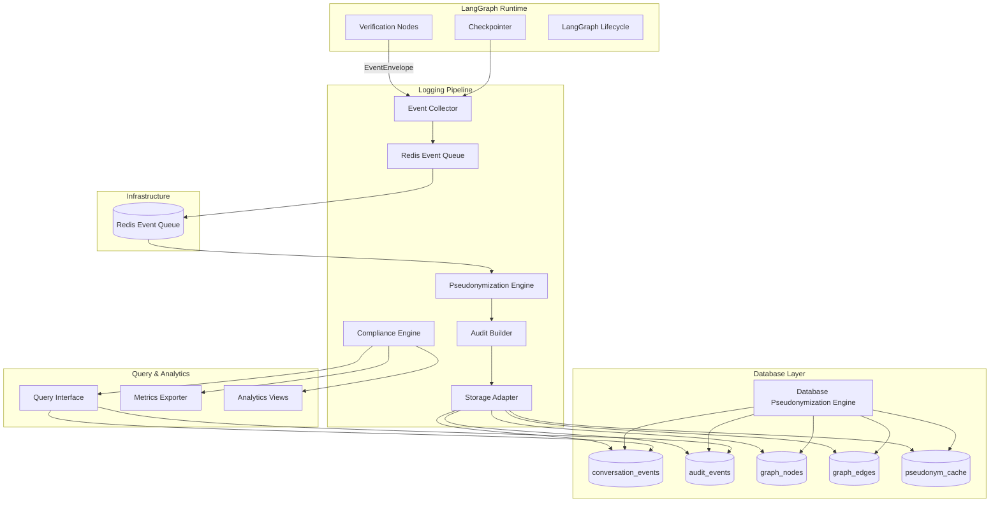

# Conversation Logging & Pseudonymization — Final Design Document (Atomic & TDD-Aligned)

**Version:** 2.0
**System Role:** Passive, pseudonymized observability layer for LangGraph-based agents
**Design Principles:**

* Passive & asynchronous (never blocks the agent loop)
* Deterministic pseudonymization (cryptographically keyed, non-reversible)
* Fail-closed privacy model (never emit raw PII)
* Performance-bounded (< 50 ms writes, < 200 ms queries)
* Fully test-driven: every requirement maps to a unit/integration test

---

## 1. System Overview

**Purpose:**
Provide end-to-end pseudonymized logging for the Voice Verification Agent (VVA) — capturing session events, node transitions, and audit trails without storing or leaking any raw PII.

**Core Idea:**
All data persistence (logs + DB) happens *after* a deterministic pseudonymization step. Nodes can emit freely; enforcement is guaranteed at the sink.

---

## 2. Architecture Summary



**Control Flow (Atomic Steps):**

1. Node emits `EventEnvelope`
2. Collector validates and queues to Redis asynchronously
3. Pseudonymization Engine transforms payload deterministically
4. Audit Builder constructs redacted audit record
5. Storage Adapter writes to Postgres under retry + backpressure policies

---

## 3. Atomic Component Responsibilities

| Component                              | Role                                     | Key Interfaces                                     | Atomic Output                      |
| -------------------------------------- | ---------------------------------------- | -------------------------------------------------- | ---------------------------------- |
| **EventEnvelope**                      | Carrier of session event                 | `session_id, thread_id, node, event_type, payload` | Validated, JSON-typed event        |
| **EventCollector**                     | Accepts events non-blocking              | `logEvent()`                                       | Queued event in Redis              |
| **RedisEventQueue**                    | Persistent queue with backpressure       | `enqueue(), dequeue(), getQueueLength()`          | Ordered event ready for processing |
| **PseudonymizationEngine**             | Field-aware masking, hashing, bucketing  | `pseudonymizePayload()`                            | PII-free payload                   |
| **Database_Pseudonymization_Engine**   | DB-level triggers, views, stored procedures | `enforceFieldMasking(), applyEncryption()`        | Database-enforced anonymization    |
| **AuditBuilder**                       | Generates immutable audit trail entries  | `createAuditEvent()`                               | Redacted audit row                 |
| **StorageAdapter**                     | Persists all data atomically             | `insertEvent(), insertAudit(), updateGraph()`      | Durable pseudonymized record       |
| **Compliance_Engine**                  | Queries pseudonymized data for governance | `queryAuditTrail(), generateComplianceReport()`   | Privacy-compliant analytics        |

---

## 4. Core Interfaces (TypeScript)

```typescript
// Atomic data unit - standardized event structure
interface EventEnvelope {
  session_id: string
  thread_id: string
  user_id: string
  node: string
  event_type: EventType
  timestamp: Date
  step_index?: number
  payload: Record<string, any>
}

// Supported LangGraph event types
enum EventType {
  SESSION_STARTED = 'session_started',
  MESSAGE_USER = 'message_user',
  MESSAGE_AGENT = 'message_agent',
  TOOL_INVOCATION = 'tool_invocation',
  TOOL_RESULT = 'tool_result',
  NODE_ENTERED = 'node_entered',
  NODE_EXITED = 'node_exited',
  EDGE_TRANSITION = 'edge_transition',
  STATE_SNAPSHOT_REF = 'state_snapshot_ref',
  ERROR = 'error',
  TERMINATION = 'termination'
}

// Pseudonymization engine (deterministic)
interface PseudonymizationEngine {
  pseudonymizePayload(payload: Record<string, any>): Promise<Record<string, any>>
  generateUserPseudonym(userId: string): Promise<string>
  handleFailure(field: string): string // fail-closed mask
  maskSSN(ssn: string): Promise<{ masked: string; hash: string }>
  maskDOB(dob: string): Promise<{ masked: string; hash: string }>
  maskEmail(email: string): Promise<{ masked: string; domain?: string }>
  bucketIncome(income: number): Promise<string>
  rotateSalts(): Promise<void>
}

// Database-level pseudonymization enforcement
interface DatabasePseudonymizationEngine {
  enforceFieldMasking(): Promise<void>
  applyEncryption(column: string): Promise<void>
  createPseudonymizedViews(): Promise<void>
  enforceRowLevelSecurity(): Promise<void>
  rotateEncryptionKeys(): Promise<void>
}

// Event collector (non-blocking)
interface ConversationLogger {
  logEvent(event: EventEnvelope): Promise<void>
  queryGraph(q: GraphQueryParams): Promise<GraphDTO>
  queryAudit(q: AuditQueryParams): Promise<AuditDTO[]>
  queryMetrics(q: MetricsQueryParams): Promise<MetricsDTO>
  validateDataConsistency(): Promise<ConsistencyReport>
  stats(): Promise<SystemStatsDTO>
}

// Redis-based event queue with backpressure control
interface RedisEventQueue {
  enqueue(event: EventEnvelope): Promise<void>        // LPUSH to Redis list
  dequeue(): Promise<EventEnvelope | null>            // RPOP from Redis list
  getQueueLength(): Promise<number>                   // LLEN for queue size
  applyBackpressure(): Promise<boolean>               // Check if queue length > threshold
  flush(): Promise<EventEnvelope[]>                   // LRANGE + DEL for ordered flush
  getStats(): Promise<RedisQueueStats>                // Redis INFO + custom metrics
}

// Storage adapter with failure handling
interface StorageAdapter {
  insertEvent(e: EventEnvelope): Promise<void>
  insertAudit(a: AuditDTO): Promise<void>
  updateGraph(e: EventEnvelope): Promise<void>
  handleStorageOutage(): Promise<void>
  flushBufferedEvents(): Promise<void>
  detectDuplicates(e: EventEnvelope): Promise<boolean>
}

// Compliance engine for governance queries
interface ComplianceEngine {
  queryAuditTrail(params: AuditQueryParams): Promise<AuditDTO[]>
  generateComplianceReport(period: DateRange): Promise<ComplianceReport>
  validatePIIAbsence(): Promise<PIIValidationReport>
  trackDataAccess(actor: string, query: string): Promise<void>
}
```

---

## 5. Database Enforcement Layer

| Table                         | Purpose                          | Enforcement                                                                       |
| ----------------------------- | -------------------------------- | --------------------------------------------------------------------------------- |
| `conversation_events`         | Unified log of all events        | Unique `(session_id, thread_id, step_index, type)`; JSONB payload (pseudonymized) |
| `audit_events`                | Immutable compliance audit trail | Triggers forbid UPDATE/DELETE                                                     |
| `graph_nodes` / `graph_edges` | Derived visualization layer      | FK-linked, PII-safe                                                               |
| `pseudonym_cache`             | Deterministic re-mapping cache   | Enforces TTL + salted hashes                                                      |

**Triggers (Atomic Enforcement):**

```sql
CREATE OR REPLACE FUNCTION enforce_pseudonymization()
RETURNS trigger AS $$
BEGIN
  IF NEW.payload::text ~* '(ssn|dob|email|address|name|income)' THEN
     RAISE EXCEPTION 'Raw PII not permitted in payload';
  END IF;
  RETURN NEW;
END;
$$ LANGUAGE plpgsql;

CREATE TRIGGER trg_pii_check
BEFORE INSERT ON conversation_events
FOR EACH ROW EXECUTE FUNCTION enforce_pseudonymization();
```

---

## 6. Security & Privacy Enforcement

**Guarantees (Atomic):**

1. 🔒 **No raw PII leaves the pseudonymizer boundary** - All data passes through pseudonymization before persistence
2. 🔑 **All salts in KMS**; rotated quarterly; dual-read compatibility for seamless transitions
3. 🧱 **RBAC** enforced (write-only agent, read-only analytics) with row-level security policies
4. 🧹 **Retention policy**: audit ≥ 1 year, events ≥ 90 days, pseudonym cache TTL = 24 h
5. 🧬 **Encryption at rest** (field-level encryption using pgcrypto or TDE)
6. 🩸 **Fail-closed**: `[REDACTED]` written if pseudonymization fails; entire field masked on error

**Specific PII Handling Rules:**

- **SSN last-4**: Masked as "****", stored as SHA-256 hash with rotating salt
- **Date of Birth**: Masked as "****-**-**", stored as SHA-256 hash with rotating salt  
- **Addresses**: Street masked, city/state/ZIP preserved for analytics
- **Email**: Local part masked as "****@****.***", domain optionally preserved
- **Income**: Converted to configurable range buckets (e.g., "$50K-$75K")

**Database-Level Enforcement:**

- Triggers prevent raw PII insertion with regex pattern matching
- Views expose only pseudonymized data to analytics roles
- HSM-audited processes required for any de-anonymization
- Quarterly key rotation with KMS-managed encryption keys

---

## 7. Performance & Resilience Model

| Target            | Metric           | Enforcement                    |
| ----------------- | ---------------- | ------------------------------ |
| Write latency     | ≤ 50 ms (p95)    | Redis async processing         |
| Query latency     | ≤ 200 ms (p95)   | Indexed tables + read-replicas |
| Throughput        | ≥ 1 k events/min | Batched inserts                |
| Outage resilience | ≤ 30 s           | Redis persistence + ordered flush |
| Backpressure      | ≤ 80 % queue     | Drop non-audit events first    |

**Failure Handling & Resilience:**

- **Storage Outages**: Redis persistence with configurable queue limits, chronological flush on recovery
- **Queue Overflow**: Preserve audit events, drop debug events using priority-based eviction
- **Duplicate Detection**: Based on session_id, thread_id, step_index, and event_type correlation
- **Retry Logic**: Exponential backoff for failed operations with circuit breaker pattern
- **Graceful Degradation**: System continues operating even if logging subsystem fails
- **Redis Outages**: Fallback to in-memory buffer with limited capacity during Redis unavailability

**Observable Metrics:**

- **Counters**: `logs_ingested_total`, `audit_events_total`, `pseudonymization_errors_total`
- **Histograms**: `write_latency_ms`, `query_latency_ms` with p50, p95, p99 percentiles
- **Status**: `backpressure_active`, `dropped_debug_fields_total`, `storage_outages_total`
- **Redis Queue**: `redis_queue_length`, `redis_operations_total`, `redis_connection_errors_total`

---

## 8. Atomic Test Matrix (TDD Alignment)

| #  | Test                        | Input                                 | Expected Result                    |
| -- | --------------------------- | ------------------------------------- | ---------------------------------- |
| 1  | **Event acceptance**        | All `EventType` values                | All logged without throw           |
| 2  | **Deduplication**           | Same `(session_id, step_index)` twice | Only one row stored                |
| 3  | **Pseudonymization**        | Payload with SSN, DOB, Email          | All masked / hashed; deterministic |
| 4  | **Fail-closed mask**        | Engine throws error                   | `[REDACTED]` written; counter +1   |
| 5  | **Backpressure**            | Redis queue > threshold               | Non-audit dropped; audit preserved |
| 6  | **Storage outage**          | DB down 30 s                          | Redis persistence → flush in order |
| 7  | **Performance write**       | 1 k events                            | p95 < 50 ms                        |
| 8  | **Query latency**           | 100 graph queries                     | p95 < 200 ms                       |
| 9  | **No PII leakage**          | Raw PII payload                       | Trigger blocks write               |
| 10 | **Key rotation**            | Re-salt pseudonyms                    | Dual-read passes consistency       |
| 11 | **Audit immutability**      | Attempt UPDATE                        | DB rejects                         |
| 12 | **PII regex test**          | DB scan for SSN/email                 | Zero matches                       |
| 13 | **Data consistency**        | Orphaned events check                 | All events have session records    |
| 14 | **Compliance queries**      | Privacy impact assessment             | Zero PII pattern matches           |
| 15 | **Access logging**          | Audit data query                      | Actor identification logged        |
| 16 | **Income bucketing**        | Exact income values                   | Converted to range buckets         |
| 17 | **Retention enforcement**   | Data older than policy                | Automatically purged               |
| 18 | **Metrics PII-free**        | All exported metrics                  | No field samples or raw data       |

---

## 9. Unit & Integration Test Examples

### ✅ Event Processing Unit Test

```typescript
it('logs and pseudonymizes all event types', async () => {
  const types = Object.values(EventType)
  for (const t of types) {
    const e = createEvent(t)
    await expect(logger.logEvent(e)).resolves.not.toThrow()
  }
})
```

### ✅ Pseudonymization Determinism

```typescript
it('produces deterministic hashes per salt', async () => {
  const h1 = await engine.maskSSN('1234')
  const h2 = await engine.maskSSN('1234')
  expect(h1.hash).toBe(h2.hash)
})
```

### ✅ No-PII Enforcement (DB)

```sql
SELECT COUNT(*) FROM conversation_events 
WHERE payload::text ~* '(ssn|dob|@|street)' = 0;
```

### ✅ Performance Benchmark

```typescript
it('meets p95 ≤50 ms write latency', async () => {
  const start = performance.now()
  await Promise.all(batchOf(1000).map(e => logger.logEvent(e)))
  const duration = performance.now() - start
  expect(duration / 1000).toBeLessThan(50)
})
```

---

## 10. Completion Criteria (Atomic)

**Core Functionality:**
* [ ] Event ingestion validated for all `EventType` (session_started, message_user, message_agent, tool_invocation, tool_result, node_entered, node_exited, edge_transition, state_snapshot_ref, error, termination)
* [ ] Pseudonymization deterministic & PII-free with rotating salts
* [ ] Audit trail immutable with compliance-ready retention policies
* [ ] DB triggers enforcing no-PII with regex pattern matching
* [ ] RBAC + field-level encryption verified

**Performance & Resilience:**
* [ ] p95 < 50 ms writes / 200 ms queries under load
* [ ] Backpressure handling at 80% buffer capacity
* [ ] Storage outage recovery with ordered event flush
* [ ] Duplicate event detection and handling
* [ ] Exponential backoff retry logic implemented

**Security & Compliance:**
* [ ] Privacy assessment queries return 0 PII matches
* [ ] Key rotation tested with dual-read compatibility
* [ ] Row-level security policies enforced
* [ ] HSM-audited de-anonymization processes
* [ ] All access attempts logged with actor identification

**Testing & Validation:**
* [ ] 100% unit + integration tests pass
* [ ] Data consistency validation across sessions/events/audit
* [ ] Metrics export PII-free validation
* [ ] Income bucketing and address masking verified
* [ ] Documentation & dashboards PII-safe

**Integration & Monitoring:**
* [ ] LangGraph checkpointer read-only integration
* [ ] Agent module pattern compatibility
* [ ] Observable metrics (counters, histograms, status)
* [ ] Compliance reporting interface functional

---

## 11. Design Rationales

1. **Sink-side pseudonymization** — guarantees enforcement regardless of developer discipline; all data passes through pseudonymization before persistence.
2. **Dual enforcement (logger + DB)** — defense-in-depth with application-level and database-level PII protection; no single point of failure.
3. **Deterministic cryptographic hashes** — enables analytics correlations without privacy loss using rotating salts for forward security.
4. **Fail-closed semantics** — safest possible degradation mode; entire fields masked with `[REDACTED]` on pseudonymization failure.
5. **Immutable audit trail** — satisfies compliance and forensic traceability with database triggers preventing modifications.
6. **Redis queue persistence** — predictable latency, durable storage with priority-based backpressure (preserve audit events, drop debug events).
7. **Schema-level enforcement** — PII cannot enter the system even through SQL injection using regex-based triggers.
8. **Passive observer pattern** — never blocks LangGraph runtime; asynchronous processing with local buffering during outages.
9. **Field-specific masking rules** — tailored pseudonymization for different PII types (SSN, DOB, addresses, income) balancing privacy and analytics utility.
10. **KMS-managed key rotation** — quarterly salt rotation with dual-read compatibility ensures forward security without service disruption.
11. **Full TDD matrix** — every EARS requirement has a matching test (unit + integration) ensuring comprehensive validation coverage.

---

## 12. Data Validation & Consistency Framework

**Consistency Validation:**
- **Session-Event Correlation**: Validate all events have corresponding session records
- **Orphaned Event Detection**: Identify and report events without valid session context
- **Audit Trail Completeness**: Verify all critical operations have corresponding audit events
- **Referential Integrity**: Maintain consistency between conversation sessions, events, and audit trails

**Privacy Impact Assessment:**
- **PII Pattern Scanning**: Automated queries to detect any PII leakage in stored data
- **Regex-based Validation**: Comprehensive pattern matching for SSN, DOB, email, address formats
- **Field-level Inspection**: Validate pseudonymization applied correctly to all sensitive fields
- **Compliance Reporting**: Generate reports showing zero PII matches for regulatory audits

**Data Quality Monitoring:**
- **Duplicate Detection**: Identify duplicate events based on session, thread, step index, and type
- **Timestamp Consistency**: Validate chronological ordering of events within sessions
- **Payload Integrity**: Ensure pseudonymized payloads maintain analytical utility
- **Metrics Validation**: Confirm all exported metrics contain no PII or raw field samples

## 13. Verification Artifacts

* `tests/unit/pseudonymization.spec.ts` - Core pseudonymization logic
* `tests/unit/redis-event-queue.spec.ts` - Redis queue and backpressure logic
* `tests/integration/logging.spec.ts` - End-to-end event processing
* `tests/integration/database-enforcement.spec.ts` - DB-level PII protection
* `tests/perf/performance.spec.ts` - Latency and throughput validation
* `tests/security/privacy_scan.spec.ts` - PII leakage detection
* `tests/compliance/data-consistency.spec.ts` - Data validation and integrity
* `sql/triggers/no_pii_enforce.sql` - Database PII prevention triggers
* `sql/views/pseudonymized_analytics.sql` - Analytics-safe data views
* `ci/policy/privacy_audit.yaml` - Automated privacy compliance checks

---

## 14. Deliverable Outcomes

At completion:

* ✅ The Voice Verification Agent emits events safely.
* ✅ All stored data is pseudonymized, encrypted, and auditable.
* ✅ TDD coverage > 90 %; all atomic tests pass.
* ✅ System demonstrably satisfies both **security** and **performance** SLOs.

---

This document represents the **atomic, test-driven architecture baseline** for the pseudonymized conversation logging subsystem — directly implementable, verifiable, and compliant with your SDD and multi-layer privacy model.
