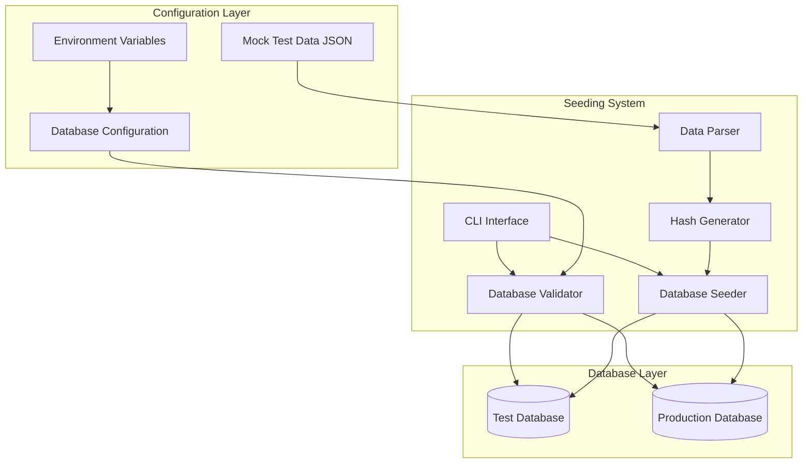
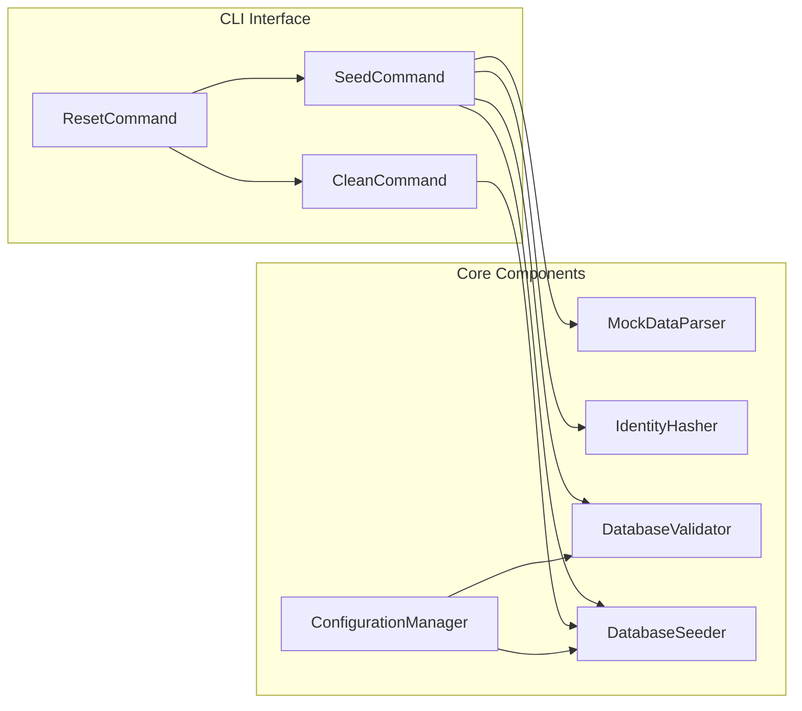
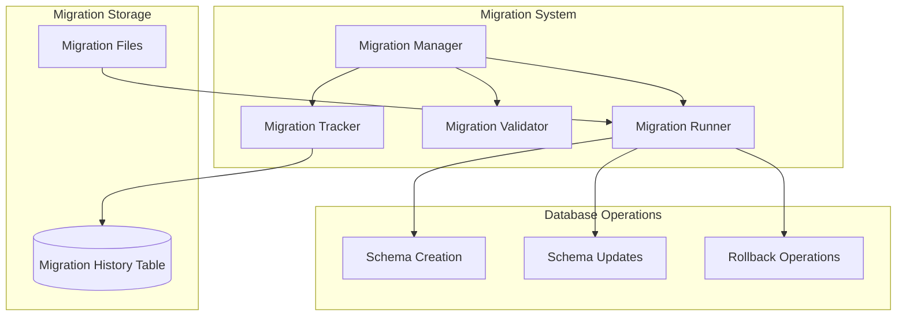

# Database Seeding System Design

## Overview

The database seeding system provides automated population of the identity_records table using predefined test scenarios from mock_test_data.json. The system supports separate test and production database environments with secure PII handling and comprehensive validation.

## Architecture

### High-Level Architecture



### Component Architecture



## Components and Interfaces

### 1. MockDataParser

**Purpose**: Parse and extract identity data from mock_test_data.json

```typescript
interface MockDataParser {
  loadTestScenarios(): Promise<TestScenario[]>
  extractIdentityData(scenario: TestScenario): IdentityRecord
  extractContactData(scenario: TestScenario): ContactRecord
  extractFinancialData(scenario: TestScenario): FinancialRecord
  extractApplicationData(scenario: TestScenario): ApplicationRecord
  handleSpecialCases(scenario: TestScenario): ProcessedRecords
}

interface TestScenario {
  scenario_name: string
  description: string
  applicant_data: ApplicantData
  expected_flow: string[]
  expected_outcome: string
  failure_reason?: string
}

interface ApplicantData {
  name: string
  date_of_birth?: string
  correct_date_of_birth?: string
  provided_date_of_birth?: string
  ssn_last_four?: string
  correct_ssn_last_four?: string
  provided_ssn_last_four?: string
  mailing_address?: MailingAddress
  initial_address?: string
  complete_address?: MailingAddress
  email?: string
  monthly_income?: number
  job_tenure_months?: number
  application_job_tenure?: number
  employment_status?: string
  job_change_reason?: string
  first_attempt?: AttemptData
  second_attempt?: AttemptData
}

interface MailingAddress {
  street: string
  unit?: string
  city: string
  state: string
  zip_code: string
}

interface AttemptData {
  date_of_birth: string
  ssn_last_four: string
}

interface ProcessedRecords {
  identity: IdentityRecord
  contact?: ContactRecord
  financial?: FinancialRecord
  application?: ApplicationRecord
  scenario: ScenarioRecord
}
```

**Key Features**:
- Handles standard applicant_data format
- Processes special cases (correct_* fields, first_attempt/second_attempt)
- Validates data format before processing
- Supports multiple identity records per scenario when needed

### 2. IdentityHasher

**Purpose**: Secure hashing of sensitive identity data

```typescript
interface IdentityHasher {
  hashSSN(ssnLast4: string): string
  hashDOB(dobISO: string): string
  validateSSNFormat(ssn: string): boolean
  validateDOBFormat(dob: string): boolean
}

class IdentityHasher implements IdentityHasher {
  private ssnSalt: string
  private dobSalt: string
  
  constructor(ssnSalt: string, dobSalt?: string) {
    this.ssnSalt = ssnSalt
    this.dobSalt = dobSalt || ssnSalt
  }
  
  hashSSN(ssnLast4: string): string {
    if (!this.validateSSNFormat(ssnLast4)) {
      throw new Error('Invalid SSN format')
    }
    return crypto.createHash('sha256')
      .update(ssnLast4 + this.ssnSalt)
      .digest('hex')
  }
}
```

### 3. DatabaseValidator

**Purpose**: Validate database connectivity and schema

```typescript
interface DatabaseValidator {
  validateConnection(databaseUrl: string): Promise<boolean>
  validateSchema(): Promise<SchemaValidationResult>
  validateEnvironment(env: 'test' | 'production'): Promise<boolean>
  checkRequiredTables(): Promise<string[]>
}

interface SchemaValidationResult {
  tablesExist: boolean
  indexesExist: boolean
  columnsValid: boolean
  missingElements: string[]
}
```

### 4. DatabaseSeeder

**Purpose**: Execute seeding operations against the database

```typescript
interface DatabaseSeeder {
  seedAllTables(processedData: ProcessedRecords[]): Promise<ComprehensiveSeedResult>
  seedIdentityRecords(records: ProcessedIdentityRecord[]): Promise<SeedResult>
  seedContactRecords(records: ProcessedContactRecord[]): Promise<SeedResult>
  seedFinancialRecords(records: ProcessedFinancialRecord[]): Promise<SeedResult>
  seedApplicationRecords(records: ProcessedApplicationRecord[]): Promise<SeedResult>
  seedScenarioRecords(records: ProcessedScenarioRecord[]): Promise<SeedResult>
  seedSystemVariables(variables: any): Promise<SeedResult>
  seedResponseTemplates(templates: any): Promise<SeedResult>
  cleanTestData(environment: string): Promise<CleanResult>
  resetTestData(): Promise<ResetResult>
  checkExistingRecords(externalRefs: string[]): Promise<string[]>
}

interface ComprehensiveSeedResult {
  identity: SeedResult
  contact: SeedResult
  financial: SeedResult
  application: SeedResult
  scenarios: SeedResult
  systemVariables: SeedResult
  responseTemplates: SeedResult
  totalRecords: number
  errors: SeedError[]
}

interface ProcessedIdentityRecord {
  external_ref: string
  name: string
  dob: Date
  dob_hash: string
  ssn4_hash: string
  created_at: Date
  updated_at: Date
}

interface ProcessedContactRecord {
  external_ref: string
  street: string
  unit?: string
  city: string
  state: string
  zip_code: string
  email?: string
  created_at: Date
  updated_at: Date
}

interface ProcessedFinancialRecord {
  external_ref: string
  monthly_income: number
  job_tenure_months?: number
  employment_status: string
  job_change_reason?: string
  created_at: Date
  updated_at: Date
}

interface ProcessedApplicationRecord {
  external_ref: string
  application_job_tenure?: number
  initial_address?: string
  complete_address?: any
  first_attempt?: any
  second_attempt?: any
  created_at: Date
  updated_at: Date
}

interface ProcessedScenarioRecord {
  scenario_name: string
  description: string
  expected_flow: string[]
  expected_outcome: string
  failure_reason?: string
  created_at: Date
  updated_at: Date
}

interface SeedResult {
  inserted: number
  updated: number
  skipped: number
  errors: SeedError[]
}
```

### 5. ConfigurationManager

**Purpose**: Manage environment-specific database configurations

```typescript
interface ConfigurationManager {
  getDatabaseUrl(environment: 'test' | 'production'): string
  validateEnvironmentVariables(): ValidationResult
  getHashingSalts(): HashingSalts
  isTestEnvironment(databaseUrl: string): boolean
}

interface HashingSalts {
  ssnSalt: string
  dobSalt?: string
}
```

### 6. MigrationManager

**Purpose**: Handle database schema migrations and versioning

```typescript
interface MigrationManager {
  runMigrations(environment: 'test' | 'production'): Promise<MigrationResult>
  rollbackMigration(version: string): Promise<MigrationResult>
  getCurrentVersion(): Promise<string>
  getPendingMigrations(): Promise<Migration[]>
  createMigration(name: string): Promise<string>
  validateMigrations(): Promise<ValidationResult>
}

interface Migration {
  version: string
  name: string
  filename: string
  up: string
  down: string
  checksum: string
  appliedAt?: Date
}

interface MigrationResult {
  success: boolean
  appliedMigrations: string[]
  errors: MigrationError[]
  currentVersion: string
}

interface MigrationError {
  migration: string
  error: string
  rollbackRequired: boolean
}
```

## Data Models

### Migration System Architecture



### Database Schema

```sql
-- Migration tracking table (created first)
CREATE TABLE IF NOT EXISTS schema_migrations (
  version VARCHAR(255) PRIMARY KEY,
  name VARCHAR(255) NOT NULL,
  filename VARCHAR(255) NOT NULL,
  checksum VARCHAR(64) NOT NULL,
  applied_at TIMESTAMP DEFAULT NOW(),
  execution_time_ms INTEGER,
  success BOOLEAN DEFAULT TRUE
);

-- Migration 001_initial_schema.sql
CREATE TABLE identity_records (
  id UUID PRIMARY KEY DEFAULT gen_random_uuid(),
  external_ref TEXT UNIQUE NOT NULL,
  name TEXT NOT NULL,
  dob DATE NOT NULL,
  dob_hash TEXT NOT NULL,
  ssn4_hash TEXT NOT NULL,
  created_at TIMESTAMP DEFAULT NOW(),
  updated_at TIMESTAMP DEFAULT NOW()
);

CREATE INDEX idx_identity_records_ref ON identity_records (external_ref);
CREATE INDEX idx_identity_records_combo ON identity_records (dob, ssn4_hash);

-- Migration 002_contact_information.sql
CREATE TABLE contact_information (
  id UUID PRIMARY KEY DEFAULT gen_random_uuid(),
  external_ref TEXT NOT NULL REFERENCES identity_records(external_ref) ON DELETE CASCADE,
  street TEXT NOT NULL,
  unit TEXT,
  city TEXT NOT NULL,
  state TEXT NOT NULL,
  zip_code TEXT NOT NULL,
  email TEXT,
  created_at TIMESTAMP DEFAULT NOW(),
  updated_at TIMESTAMP DEFAULT NOW()
);

CREATE INDEX idx_contact_info_ref ON contact_information (external_ref);

-- Migration 003_financial_data.sql
CREATE TABLE financial_data (
  id UUID PRIMARY KEY DEFAULT gen_random_uuid(),
  external_ref TEXT NOT NULL REFERENCES identity_records(external_ref) ON DELETE CASCADE,
  monthly_income INTEGER NOT NULL,
  job_tenure_months INTEGER,
  employment_status TEXT DEFAULT 'employed',
  job_change_reason TEXT,
  created_at TIMESTAMP DEFAULT NOW(),
  updated_at TIMESTAMP DEFAULT NOW()
);

CREATE INDEX idx_financial_data_ref ON financial_data (external_ref);

-- Migration 004_application_data.sql
CREATE TABLE application_data (
  id UUID PRIMARY KEY DEFAULT gen_random_uuid(),
  external_ref TEXT NOT NULL REFERENCES identity_records(external_ref) ON DELETE CASCADE,
  application_job_tenure INTEGER,
  initial_address TEXT,
  complete_address JSONB,
  first_attempt JSONB,
  second_attempt JSONB,
  created_at TIMESTAMP DEFAULT NOW(),
  updated_at TIMESTAMP DEFAULT NOW()
);

CREATE INDEX idx_application_data_ref ON application_data (external_ref);

-- Migration 005_test_scenarios.sql
CREATE TABLE test_scenarios (
  id UUID PRIMARY KEY DEFAULT gen_random_uuid(),
  scenario_name TEXT UNIQUE NOT NULL,
  description TEXT NOT NULL,
  expected_flow TEXT[] NOT NULL,
  expected_outcome TEXT NOT NULL,
  failure_reason TEXT,
  created_at TIMESTAMP DEFAULT NOW(),
  updated_at TIMESTAMP DEFAULT NOW()
);

CREATE INDEX idx_test_scenarios_name ON test_scenarios (scenario_name);

-- Migration 006_system_configuration.sql
CREATE TABLE system_variables (
  id UUID PRIMARY KEY DEFAULT gen_random_uuid(),
  variable_name TEXT UNIQUE NOT NULL,
  variable_value JSONB NOT NULL,
  description TEXT,
  created_at TIMESTAMP DEFAULT NOW(),
  updated_at TIMESTAMP DEFAULT NOW()
);

CREATE TABLE response_templates (
  id UUID PRIMARY KEY DEFAULT gen_random_uuid(),
  template_name TEXT UNIQUE NOT NULL,
  template_content TEXT NOT NULL,
  description TEXT,
  created_at TIMESTAMP DEFAULT NOW(),
  updated_at TIMESTAMP DEFAULT NOW()
);

-- Migration 007_audit_tables.sql
CREATE TABLE seeding_audit (
  id UUID PRIMARY KEY DEFAULT gen_random_uuid(),
  operation_type VARCHAR(20) NOT NULL, -- 'seed', 'clean', 'reset'
  environment VARCHAR(20) NOT NULL,    -- 'test', 'production'
  records_affected INTEGER NOT NULL,
  tables_affected TEXT[] NOT NULL,
  operation_timestamp TIMESTAMP DEFAULT NOW(),
  operation_details JSONB
);
```

### Docker Compose Configuration

```yaml
# Updated docker-compose.yml structure
services:
  # Test Database
  postgres-test:
    image: pgvector/pgvector:pg15
    container_name: ${COMPOSE_PROJECT_NAME:-multi-agent-ai}-postgres-test
    environment:
      POSTGRES_DB: ${POSTGRES_TEST_DB:-agents_app_test}
      POSTGRES_USER: ${POSTGRES_USER}
      POSTGRES_PASSWORD: ${POSTGRES_PASSWORD}
    ports:
      - "${POSTGRES_TEST_PORT:-5433}:5432"
    volumes:
      - postgres_test_data:/var/lib/postgresql/data
      - ./docker/postgres/init:/docker-entrypoint-initdb.d:ro
    networks:
      - app-network

  # Production Database  
  postgres-prod:
    image: pgvector/pgvector:pg15
    container_name: ${COMPOSE_PROJECT_NAME:-multi-agent-ai}-postgres-prod
    environment:
      POSTGRES_DB: ${POSTGRES_DB:-agents_app_prod}
      POSTGRES_USER: ${POSTGRES_USER}
      POSTGRES_PASSWORD: ${POSTGRES_PASSWORD}
    ports:
      - "${POSTGRES_PORT:-5432}:5432"
    volumes:
      - postgres_prod_data:/var/lib/postgresql/data
      - ./docker/postgres/init:/docker-entrypoint-initdb.d:ro
    networks:
      - app-network

volumes:
  postgres_test_data:
  postgres_prod_data:
```

## Error Handling

### Error Categories

1. **Configuration Errors**
   - Missing environment variables
   - Invalid database URLs
   - Missing salt values

2. **Data Validation Errors**
   - Invalid SSN format
   - Invalid date format
   - Missing required fields in mock data

3. **Database Errors**
   - Connection failures
   - Schema validation failures
   - Constraint violations

4. **Security Errors**
   - Attempting to seed production with test data
   - Hash generation failures
   - PII exposure in logs

### Error Handling Strategy

```typescript
class SeedingError extends Error {
  constructor(
    message: string,
    public category: 'config' | 'validation' | 'database' | 'security',
    public recoverable: boolean = false,
    public details?: any
  ) {
    super(message)
  }
}

class ErrorHandler {
  handleError(error: SeedingError): void {
    // Log error without exposing PII
    this.logError(this.sanitizeError(error))
    
    if (!error.recoverable) {
      process.exit(1)
    }
  }
  
  private sanitizeError(error: SeedingError): SeedingError {
    // Remove any potential PII from error messages
    const sanitizedMessage = error.message
      .replace(/\d{4}-\d{2}-\d{2}/g, '****-**-**')
      .replace(/\d{4}(?=\D|$)/g, '****')
    
    return new SeedingError(
      sanitizedMessage,
      error.category,
      error.recoverable,
      this.sanitizeDetails(error.details)
    )
  }
}
```

## Testing Strategy

### Unit Tests

1. **MockDataParser Tests**
   - Parse valid mock data scenarios
   - Handle malformed JSON
   - Extract identity data correctly
   - Process special case scenarios

2. **IdentityHasher Tests**
   - Hash SSN consistently
   - Validate input formats
   - Handle invalid inputs gracefully
   - Use correct salt values

3. **DatabaseValidator Tests**
   - Validate database connections
   - Check schema completeness
   - Detect missing tables/indexes
   - Environment validation

### Integration Tests

1. **End-to-End Seeding**
   - Seed complete mock data set
   - Verify data integrity
   - Test update vs insert logic
   - Validate hash consistency

2. **Database Environment Tests**
   - Test database separation
   - Validate environment detection
   - Test production protection
   - Verify connection routing

3. **CLI Interface Tests**
   - Test all command options
   - Validate error handling
   - Test environment targeting
   - Verify output formatting

### Test Data Management

```typescript
// Test utilities for seeding tests
class TestDatabaseManager {
  async createTestDatabase(): Promise<string> {
    // Create isolated test database
  }
  
  async cleanupTestDatabase(dbUrl: string): Promise<void> {
    // Clean up after tests
  }
  
  async seedMinimalData(dbUrl: string): Promise<void> {
    // Seed minimal test data
  }
}
```

## Security Considerations

### PII Protection

1. **Hash Generation**
   - Use SHA-256 with environment-specific salts
   - Never log raw SSN or DOB values
   - Validate input format before hashing

2. **Logging Security**
   - Redact PII in all log messages
   - Use structured logging with sanitization
   - Audit all seeding operations

3. **Environment Isolation**
   - Prevent test data in production
   - Validate database environment before seeding
   - Use separate database instances

### Access Control

```typescript
class SecurityValidator {
  validateEnvironmentSafety(
    databaseUrl: string, 
    operation: 'seed' | 'clean' | 'reset'
  ): boolean {
    const isProduction = this.isProductionDatabase(databaseUrl)
    const isTestData = operation === 'seed'
    
    if (isProduction && isTestData) {
      throw new SeedingError(
        'Cannot seed test data to production database',
        'security',
        false
      )
    }
    
    return true
  }
}
```

## Performance Considerations

### Batch Processing

```typescript
class BatchSeeder {
  private readonly BATCH_SIZE = 100
  
  async seedInBatches(records: ProcessedIdentityRecord[]): Promise<SeedResult> {
    const batches = this.createBatches(records, this.BATCH_SIZE)
    const results: SeedResult[] = []
    
    for (const batch of batches) {
      const result = await this.seedBatch(batch)
      results.push(result)
    }
    
    return this.aggregateResults(results)
  }
}
```

### Connection Management

- Use connection pooling for database operations
- Implement connection timeout and retry logic
- Close connections properly after operations
- Monitor connection usage during seeding

### Migration File Structure

```
migrations/
├── 001_initial_schema.sql
├── 002_contact_information.sql
├── 003_financial_data.sql
├── 004_application_data.sql
├── 005_test_scenarios.sql
├── 006_system_configuration.sql
├── 007_audit_tables.sql
└── rollbacks/
    ├── 001_initial_schema_rollback.sql
    ├── 002_contact_information_rollback.sql
    ├── 003_financial_data_rollback.sql
    ├── 004_application_data_rollback.sql
    ├── 005_test_scenarios_rollback.sql
    ├── 006_system_configuration_rollback.sql
    └── 007_audit_tables_rollback.sql
```

### Migration File Format

```sql
-- Migration: 001_initial_schema
-- Description: Create initial identity_records table
-- Author: System
-- Date: 2024-01-01

-- UP Migration
CREATE TABLE identity_records (
  id UUID PRIMARY KEY DEFAULT gen_random_uuid(),
  external_ref TEXT UNIQUE NOT NULL,
  name TEXT NOT NULL,
  dob DATE NOT NULL,
  dob_hash TEXT NOT NULL,
  ssn4_hash TEXT NOT NULL,
  created_at TIMESTAMP DEFAULT NOW(),
  updated_at TIMESTAMP DEFAULT NOW()
);

-- Rollback instructions in separate file: rollbacks/001_initial_schema_rollback.sql
```

## CLI Interface Design

### Command Structure

```bash
# Migration commands
npm run migrate:up -- --env=test
npm run migrate:down -- --env=test --version=003
npm run migrate:status -- --env=test
npm run migrate:create -- --name=add_new_field

# Seed test database with mock data
npm run seed:test

# Seed specific environment
npm run seed -- --env=test --confirm

# Clean test data
npm run seed:clean -- --env=test

# Reset (clean + seed)
npm run seed:reset -- --env=test

# Validate database setup
npm run seed:validate -- --env=test

# Full setup (migrate + seed)
npm run setup:test
```

### Command Implementation

```typescript
interface CLIOptions {
  environment: 'test' | 'production'
  confirm: boolean
  dryRun: boolean
  verbose: boolean
  batchSize?: number
  version?: string
  name?: string
}

class MigrationCLI {
  async runMigrations(options: CLIOptions): Promise<void> {
    const migrationManager = new MigrationManager(options.environment)
    
    // Validate environment and database connectivity
    await this.validateEnvironment(options.environment)
    
    // Run pending migrations
    const result = await migrationManager.runMigrations(options.environment)
    
    // Report results
    this.reportMigrationResults(result)
  }
  
  async rollbackMigration(options: CLIOptions): Promise<void> {
    if (!options.version) {
      throw new Error('Version required for rollback')
    }
    
    const migrationManager = new MigrationManager(options.environment)
    const result = await migrationManager.rollbackMigration(options.version)
    
    this.reportMigrationResults(result)
  }
  
  async createMigration(options: CLIOptions): Promise<void> {
    if (!options.name) {
      throw new Error('Migration name required')
    }
    
    const migrationManager = new MigrationManager(options.environment)
    const filename = await migrationManager.createMigration(options.name)
    
    console.log(`Created migration: ${filename}`)
  }
  
  async getMigrationStatus(options: CLIOptions): Promise<void> {
    const migrationManager = new MigrationManager(options.environment)
    const currentVersion = await migrationManager.getCurrentVersion()
    const pending = await migrationManager.getPendingMigrations()
    
    console.log(`Current version: ${currentVersion}`)
    console.log(`Pending migrations: ${pending.length}`)
    pending.forEach(m => console.log(`  - ${m.version}: ${m.name}`))
  }
}

class SeedCLI {
  async executeSeed(options: CLIOptions): Promise<void> {
    // Ensure migrations are up to date first
    const migrationCLI = new MigrationCLI()
    await migrationCLI.runMigrations(options)
    
    // Validate options and environment
    await this.validateEnvironment(options.environment)
    
    // Execute seeding with progress reporting
    const seeder = new DatabaseSeeder(options.environment)
    const result = await seeder.seedAllTables(await this.loadProcessedData())
    
    // Handle errors and provide user feedback
    this.reportSeedResults(result)
  }
  
  async executeFullSetup(options: CLIOptions): Promise<void> {
    console.log('Running full database setup...')
    
    // Step 1: Run migrations
    console.log('1. Running database migrations...')
    const migrationCLI = new MigrationCLI()
    await migrationCLI.runMigrations(options)
    
    // Step 2: Seed data
    console.log('2. Seeding test data...')
    await this.executeSeed(options)
    
    console.log('Database setup complete!')
  }
}
```

This design provides a comprehensive, secure, and maintainable solution for database seeding that integrates with the existing mock test data structure and supports the required database separation.