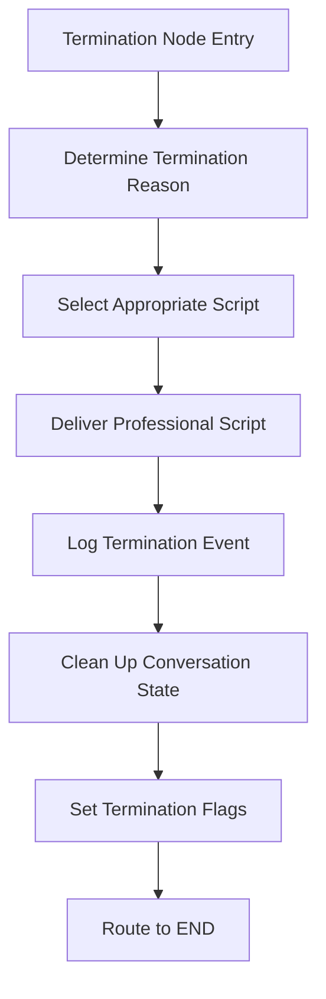

# Termination Node — Design (Professional Closure, Audit-Compliant v1.0)

## Overview

A **professional conversation closure** node that delivers exact scope-approved termination scripts when verification fails and ensures proper audit logging without PII exposure. This node serves as the **final safety net** for all failure scenarios, implementing empathetic closure while maintaining strict compliance standards.

* **Always terminates** → `conversationTerminated=true`, routes to `END` node
* **Professional scripts** → Exact approved messaging for different failure types
* **Audit compliant** → PII-free logging with proper reason classification

The node uses **fail-closed security** and maintains **professional customer relationships** even during verification failures through carefully crafted termination messaging.

## Assumptions

* **Terminal node:** Always the final step before END, never routes to other nodes
* **Script approval:** Exact termination scripts are pre-approved and must be delivered verbatim
* **Audit requirements:** All terminations must be logged with reason codes but no PII
* **State cleanup:** Node responsible for clean conversation state closure
* **Error handling:** All system errors result in professional termination (fail-closed)
* **Session integrity:** Termination preserves session correlation for audit trails

## Architecture

### Node Interface

```ts
type TerminationNodeInput = {
  state: ConversationState;
  config?: {
    callbacks?: { onEvent?: (e: any) => void };
    configurable?: { thread_id?: string }; // session id for checkpointer
    metadata?: { user_id?: string; applicant_name?: string; scenario_name?: string };
  };
};

type TerminationNodeOutput = {
  conversationTerminated: boolean;
  terminatedAt: string;
  terminationReason: TerminationReason;
  needs: { identity: false; contact: false; financial: false; confirm: false };
};

type TerminationReason = 
  | 'IDENTITY_FAILURE'
  | 'SYSTEM_ERROR'
  | 'TIMEOUT'
  | 'INCOMPLETE_DATA'
  | 'RATE_LIMITED'
  | 'UNKNOWN_ERROR';
```

### Data Models

#### Script Selection Map (Dedicated Module)

```ts
// scripts/termination-scripts.ts - Dedicated module to prevent drift
type TerminationScripts = Record<CanonicalTerminationReason, string>;

export const APPROVED_TERMINATION_SCRIPTS: TerminationScripts = {
  // Scope-approved identity script (exact verbatim)
  IDENTITY_FAILURE: "I understand this can be frustrating. However, the last four digits of your Social Security Number and date of birth are required to proceed with the verification. Since we're unable to verify this information today, I'll need to conclude our call. Thank you for your time, and please feel free to call back when you have this information available.",
  
  // Generic system error script
  SYSTEM_ERROR: "I apologize, but we're experiencing technical difficulties that prevent us from completing your verification at this time. Please try calling back in a few minutes. Thank you for your patience and understanding.",
  
  // Timeout-specific script
  TIMEOUT: "I notice we haven't heard from you in a while. For security purposes, I'll need to end our call now. Please feel free to call back when you're ready to complete the verification process.",
  
  // Rate limiting script
  RATE_LIMITED: "For security purposes, we have limits on verification attempts. Please wait before trying again, or contact customer service for assistance. Thank you for your understanding.",
  
  // User abort script
  USER_ABORT: "I understand you need to end our call. Thank you for your time today. Please feel free to call back when you're ready to complete the verification process.",
  
  // Incomplete data script
  INCOMPLETE_DATA: "I apologize, but we're unable to complete the verification process due to missing information. Please call back when you have all required documents available. Thank you for your understanding.",
  
  // Fallback script
  UNKNOWN_ERROR: "I apologize, but we're unable to complete your verification at this time. Please try calling back later. Thank you for your patience."
};

// Explicit mapping function with validation
export function selectTerminationScript(reason: CanonicalTerminationReason): string {
  const script = APPROVED_TERMINATION_SCRIPTS[reason];
  
  if (!script) {
    console.warn(`No script found for reason: ${reason}, using fallback`);
    return APPROVED_TERMINATION_SCRIPTS.UNKNOWN_ERROR;
  }
  
  return script;
}
```

#### Structured Telemetry Schema

```ts
// Consistent event envelope matching system-wide telemetry
type TerminationTelemetryEvent = {
  // Standard envelope fields
  node: 'terminate';
  session_id: string;
  user_id?: string;
  event_type: 'conversation_terminated';
  created_at: string;
  
  // Termination-specific data
  termination_reason: CanonicalTerminationReason;
  terminated_at: string;
  conversation_duration_ms?: number;
  
  // Attempt summary (no PII)
  attempts_summary: {
    identity_attempts: number;
    contact_attempts: number;
    financial_attempts: number;
    confirmation_attempts: number;
    total_nodes_visited: number;
  };
  
  // Metadata
  applicant_name?: string;
  scenario_name?: string;
  
  // Explicit redactions (even if empty) for consistency
  redactions: {
    dob: null;
    ssn: null;
    email: null;
    address: null;
  };
  
  // Success flag for metrics
  success: true; // Termination always "succeeds"
};
```

## Core Logic

### Algorithm Flow



### Algorithm Steps

1. **Reason Classification**
   * Analyze `state.lastError` for system errors
   * Check `state.attempts` for failure patterns
   * Examine routing context for timeout/rate-limit indicators
   * Default to `UNKNOWN_ERROR` if reason unclear

2. **Script Selection**
   * Map termination reason to approved script
   * Ensure exact verbatim delivery (no modifications)
   * Handle missing scripts with fallback to `UNKNOWN_ERROR`

3. **Professional Delivery**
   * Deliver selected script with appropriate tone
   * Maintain empathetic, professional communication
   * Provide clear closure without technical details

4. **Audit Logging**
   * Generate termination audit event with reason codes
   * Include session correlation and timing data
   * Redact all PII while preserving audit value
   * Log conversation summary statistics

5. **State Cleanup**
   * Set `conversationTerminated = true`
   * Record `terminatedAt` timestamp
   * Clear all `needs` flags to false
   * Preserve session integrity for audit

## Termination Reason Classification

### Reason Code Normalization

```ts
// Canonical reason codes used system-wide for consistency
type CanonicalTerminationReason = 
  | 'IDENTITY_FAILURE'
  | 'SYSTEM_ERROR'
  | 'TIMEOUT'
  | 'RATE_LIMITED'
  | 'USER_ABORT'
  | 'INCOMPLETE_DATA'
  | 'UNKNOWN_ERROR';

// Normalization mapping from various error codes to canonical reasons
const ERROR_CODE_MAPPING: Record<string, CanonicalTerminationReason> = {
  // Identity-related errors
  'IDENTITY_NOT_VERIFIED': 'IDENTITY_FAILURE',
  'DOB_MISMATCH': 'IDENTITY_FAILURE',
  'SSN_MISMATCH': 'IDENTITY_FAILURE',
  'NOT_FOUND': 'IDENTITY_FAILURE',
  'INVALID_INPUT': 'IDENTITY_FAILURE',
  
  // System errors
  'SYSTEM_ERROR': 'SYSTEM_ERROR',
  'DATABASE_ERROR': 'SYSTEM_ERROR',
  'CONNECTION_ERROR': 'SYSTEM_ERROR',
  'VALIDATION_ERROR': 'SYSTEM_ERROR',
  
  // Timeout and rate limiting
  'TIMEOUT': 'TIMEOUT',
  'SESSION_TIMEOUT': 'TIMEOUT',
  'RATE_LIMITED': 'RATE_LIMITED',
  'TOO_MANY_ATTEMPTS': 'RATE_LIMITED',
  
  // User actions
  'USER_ABORT': 'USER_ABORT',
  'USER_DISCONNECT': 'USER_ABORT',
  
  // Data issues
  'INCOMPLETE_DATA': 'INCOMPLETE_DATA',
  'MISSING_PREREQUISITES': 'INCOMPLETE_DATA'
};

function normalizeTerminationReason(state: ConversationState): CanonicalTerminationReason {
  // Check for explicit error codes first
  if (state.lastError?.code) {
    const normalized = ERROR_CODE_MAPPING[state.lastError.code];
    if (normalized) return normalized;
  }
  
  // Check attempt patterns for identity failures
  if (state.attempts?.identity >= 2 && !state.identityVerified) {
    return 'IDENTITY_FAILURE';
  }
  
  // Check for timeout indicators
  if (isSessionTimeout(state)) {
    return 'TIMEOUT';
  }
  
  // Default fallback
  return 'UNKNOWN_ERROR';
}

function isSessionTimeout(state: ConversationState): boolean {
  // Implementation would check session duration, last activity, etc.
  return false; // Placeholder
}
```

### Script Delivery Implementation

```ts
function deliverTerminationScript(reason: TerminationReason): string {
  const script = APPROVED_SCRIPTS[reason];
  
  if (!script) {
    // Fallback to unknown error script
    return APPROVED_SCRIPTS.UNKNOWN_ERROR;
  }
  
  // Return exact script - no modifications allowed
  return script;
}
```

## Security Implementation

### PII-Free Audit Logging

```ts
function generateTerminationAuditEvent(
  state: ConversationState,
  reason: TerminationReason,
  config: NodeConfig
): TerminationAuditEvent {
  const sessionId = config?.configurable?.thread_id;
  const userId = config?.metadata?.user_id;
  const terminatedAt = new Date().toISOString();
  
  return {
    session_id: sessionId,
    user_id: userId,
    node: 'terminate',
    event_type: 'conversation_terminated',
    termination_reason: reason,
    terminated_at: terminatedAt,
    conversation_duration_ms: calculateDuration(state),
    attempts_summary: {
      identity_attempts: state.attempts?.identity || 0,
      total_nodes_visited: countNodesVisited(state)
    },
    applicant_name: config?.metadata?.applicant_name,
    scenario_name: config?.metadata?.scenario_name
    // NO PII - only metadata and statistics
  };
}

function calculateDuration(state: ConversationState): number {
  // Calculate conversation duration from state timestamps
  // Implementation would track conversation start time
  return 0; // Placeholder
}

function countNodesVisited(state: ConversationState): number {
  // Count how many nodes were visited during conversation
  let count = 0;
  if (state.identityVerified !== undefined) count++;
  if (state.collected?.contact) count++;
  if (state.collected?.financial) count++;
  return count;
}
```

### State Cleanup Policy

```ts
function cleanupConversationState(state: ConversationState): Partial<ConversationState> {
  return {
    // Set termination flags
    conversationTerminated: true,
    terminatedAt: new Date().toISOString(),
    
    // Clear all needs flags for clean terminal state
    needs: {
      identity: false,
      contact: false,
      financial: false,
      confirm: false
    },
    
    // Clear transient error fields
    lastError: null,
    
    // Clear any pending correction hints or temporary state
    correctionHints: null,
    retryContext: null,
    
    // Preserve collected data for compliance audit
    // Do not clear collected data as it may be needed for regulatory requirements
    // collected: state.collected (preserved)
    
    // Preserve attempt counts for audit trail
    // attempts: state.attempts (preserved)
  };
}

// Idempotency guard - avoid duplicate processing
function isAlreadyTerminated(state: ConversationState): boolean {
  return state.conversationTerminated === true;
}
```

## Error Handling

### Fail-Closed Approach

| Error Type | Behavior | Script Used |
|------------|----------|-------------|
| Script missing | Use UNKNOWN_ERROR fallback | UNKNOWN_ERROR |
| Logging failure | Continue with termination | Original reason script |
| State corruption | Clean termination | SYSTEM_ERROR |
| Network timeout | Immediate termination | TIMEOUT |

### Error Recovery

```ts
function handleTerminationError(error: Error, fallbackReason: TerminationReason): TerminationResult {
  // Log error internally but don't expose to user
  console.error('Termination error:', error.message);
  
  // Always deliver professional script regardless of internal errors
  return {
    script: APPROVED_SCRIPTS[fallbackReason] || APPROVED_SCRIPTS.UNKNOWN_ERROR,
    reason: fallbackReason,
    success: true // Termination always "succeeds" from user perspective
  };
}
```

## LangGraph Integration

### Node Implementation with Idempotency and Metrics

```ts
// nodes/termination.ts
import { RunnableLambda } from "@langchain/core/runnables";
import { normalizeTerminationReason, selectTerminationScript, generateTerminationTelemetry } from "../utils/termination";
import { isAlreadyTerminated, cleanupConversationState } from "../utils/state-cleanup";
import { incrementMetric } from "../utils/metrics";

export const terminationNode = RunnableLambda.from(async ({ state, config }) => {
  const startTime = Date.now();
  
  try {
    // Idempotency guard - avoid duplicate processing
    if (isAlreadyTerminated(state)) {
      console.log('Termination node re-invoked, returning existing state');
      return {}; // No-op, state already terminated
    }
    
    // 1) Normalize termination reason using canonical mapping
    const reason = normalizeTerminationReason(state);
    
    // 2) Select appropriate script from dedicated module
    const script = selectTerminationScript(reason);
    
    // 3) Generate structured telemetry event
    const telemetryEvent = generateTerminationTelemetry(state, reason, config);
    
    // 4) Emit telemetry with consistent envelope
    config?.callbacks?.onEvent?.(telemetryEvent);
    
    // 5) Increment metrics for ops visibility
    incrementMetric('termination.total');
    incrementMetric(`termination.by_reason.${reason.toLowerCase()}`);
    
    // 6) Clean up conversation state with policy
    const cleanupState = cleanupConversationState(state);
    
    const executionTime = Date.now() - startTime;
    incrementMetric('termination.execution_time_ms', executionTime);
    
    // 7) Return final state (always terminates)
    return {
      ...cleanupState,
      terminationReason: reason,
      terminationScript: script,
      executionTimeMs: executionTime
    };
    
  } catch (error) {
    // Fail-closed: always terminate professionally even on internal errors
    incrementMetric('termination.internal_error');
    
    const fallbackEvent: TerminationTelemetryEvent = {
      node: 'terminate',
      session_id: config?.configurable?.thread_id || 'unknown',
      event_type: 'termination_error',
      created_at: new Date().toISOString(),
      termination_reason: 'UNKNOWN_ERROR',
      terminated_at: new Date().toISOString(),
      attempts_summary: {
        identity_attempts: 0,
        contact_attempts: 0,
        financial_attempts: 0,
        confirmation_attempts: 0,
        total_nodes_visited: 0
      },
      redactions: { dob: null, ssn: null, email: null, address: null },
      success: true
    };
    
    config?.callbacks?.onEvent?.(fallbackEvent);
    
    return {
      conversationTerminated: true,
      terminatedAt: new Date().toISOString(),
      terminationReason: 'UNKNOWN_ERROR',
      terminationScript: selectTerminationScript('UNKNOWN_ERROR'),
      needs: { identity: false, contact: false, financial: false, confirm: false },
      lastError: null // Clear error state
    };
  }
});
```

### Routing Contract Integration

```ts
// Termination node always routes to END - explicit contract
const routeFromTermination = (): string => "END";

// Graph configuration with proper termination routing
const graph = new StateGraph(VerificationState)
  .addNode("terminate", terminationNode)
  .addEdge("terminate", "END") // Explicit edge to END
  
  // All nodes can route to terminate on failure
  .addConditionalEdges("identity", ({ state }) => {
    if (state.identityVerified) return "contact";
    if (state.attempts.identity >= 2) return "terminate";
    return "identity";
  })
  .addConditionalEdges("contact", ({ state }) => {
    if (state.lastError) return "terminate";
    return state.needs.financial ? "financial" : "confirm";
  })
  .addConditionalEdges("financial", ({ state }) => {
    if (state.lastError) return "terminate";
    return "confirm";
  })
  .addConditionalEdges("confirm", ({ state }) => {
    if (state.lastError) return "terminate";
    if (state.verificationComplete) return "END";
    if (state.needs.contact) return "contact"; // Correction flow
    return "confirm"; // Retry
  });

// Global error handler also routes to terminate
export const app = graph.compile({
  checkpointer: new PostgresSaver({ /* pg pool */ }),
  onError: async (err, ctx) => {
    // Update state with error and route to terminate
    ctx.update({ 
      lastError: { 
        code: err.name || 'UNKNOWN_ERROR', 
        recoverable: false 
      } 
    });
    return "terminate"; // Reuse same termination logic
  },
});
```

## Metrics and Observability

### Termination Metrics

```ts
// utils/metrics.ts
export function incrementMetric(name: string, value: number = 1): void {
  // Implementation would integrate with Prometheus/OpenTelemetry
  console.log(`Metric: ${name} += ${value}`);
}

// Key metrics for ops visibility
const TERMINATION_METRICS = {
  // Total terminations
  'termination.total': 'Counter of all terminations',
  
  // By reason
  'termination.by_reason.identity_failure': 'Identity verification failures',
  'termination.by_reason.system_error': 'System/technical errors',
  'termination.by_reason.timeout': 'Session timeouts',
  'termination.by_reason.rate_limited': 'Rate limit violations',
  'termination.by_reason.user_abort': 'User-initiated terminations',
  'termination.by_reason.incomplete_data': 'Missing data terminations',
  'termination.by_reason.unknown_error': 'Unclassified terminations',
  
  // Performance
  'termination.execution_time_ms': 'Histogram of termination execution time',
  'termination.internal_error': 'Counter of internal termination errors',
  
  // Conversation quality
  'termination.conversation_duration_ms': 'Histogram of conversation length before termination',
  'termination.nodes_visited_before_termination': 'Histogram of progress before termination'
};
```

## Performance Considerations

* **Script Delivery**: Pre-loaded scripts for immediate delivery (<100ms)
* **Idempotency**: Guard against duplicate processing on replay/retry
* **Audit Logging**: Asynchronous telemetry emission to prevent delays
* **State Cleanup**: Minimal operations with explicit cleanup policy
* **Memory Management**: Clear transient state while preserving audit data
* **Metrics Collection**: Lightweight counters for operational visibility

## Testing Strategy

### Professional Script Validation

```ts
describe('Professional Script Delivery', () => {
  test('delivers exact identity failure script', () => {
    const state = { attempts: { identity: 2 }, identityVerified: false };
    const result = classifyTerminationReason(state);
    const script = deliverTerminationScript(result);
    
    expect(result).toBe('IDENTITY_FAILURE');
    expect(script).toBe(APPROVED_SCRIPTS.IDENTITY_FAILURE);
  });
  
  test('maintains professional tone in all scripts', () => {
    Object.values(APPROVED_SCRIPTS).forEach(script => {
      expect(script).toMatch(/thank you|apologize|understand/i);
      expect(script).not.toMatch(/error|failed|system/i);
    });
  });
});
```

### Security and Audit Tests

```ts
describe('Security and Audit', () => {
  test('no PII in termination audit events', () => {
    const state = createTestState();
    const auditEvent = generateTerminationAuditEvent(state, 'IDENTITY_FAILURE', config);
    
    expect(JSON.stringify(auditEvent)).not.toMatch(/\d{4}-\d{2}-\d{2}/); // No DOB
    expect(JSON.stringify(auditEvent)).not.toMatch(/\d{4}/); // No SSN
    expect(JSON.stringify(auditEvent)).not.toMatch(/@/); // No email
  });
  
  test('audit event contains required fields', () => {
    const auditEvent = generateTerminationAuditEvent(state, 'SYSTEM_ERROR', config);
    
    expect(auditEvent).toHaveProperty('session_id');
    expect(auditEvent).toHaveProperty('termination_reason');
    expect(auditEvent).toHaveProperty('terminated_at');
    expect(auditEvent).toHaveProperty('attempts_summary');
  });
});
```

## Configuration

```ts
type TerminationConfig = {
  TERMINATION_TIMEOUT_MS: number; // default 500
  AUDIT_LOGGING_ENABLED: boolean; // default true
  SCRIPT_VALIDATION_ENABLED: boolean; // default true
  FALLBACK_SCRIPT_REASON: TerminationReason; // default 'UNKNOWN_ERROR'
};
```

## Dependencies & Versions

* **LangGraph**: ^0.2.0 (state management, routing)
* **Node.js**: 18+ (date handling, string operations)
* **TypeScript**: 5.0+ (strict type checking)

## Summary

| Aspect | Implementation |
|--------|----------------|
| **Professional Communication** | Exact approved scripts for all failure types |
| **Security** | PII-free audit logging and fail-closed error handling |
| **Reliability** | Always terminates successfully with appropriate messaging |
| **Compliance** | Audit trails with reason codes and session correlation |
| **Performance** | Sub-500ms termination with pre-loaded scripts |
| **Integration** | Clean LangGraph routing with proper state cleanup |
| **Testability** | Comprehensive validation of scripts and security |

This termination node design ensures professional, compliant conversation closure while maintaining strict security standards and providing excellent customer experience even during verification failures.